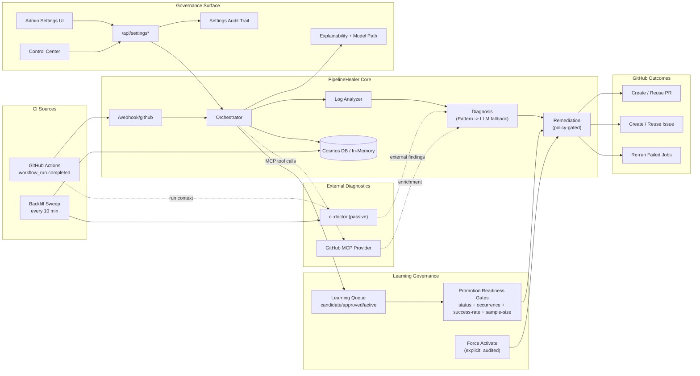

# PipelineHealer

<!-- LAST_VERIFIED: 74e2d09 -->

> Policy-aware CI/CD remediation platform for GitHub Actions failures.

[](https://ca-canepro-ph-frontend.kinddune-53ac219d.eastus2.azurecontainerapps.io)
[](https://azure.microsoft.com)
[](LICENSE)

PipelineHealer ingests failed workflow runs, diagnoses root cause, and applies safe remediation policy:
- deterministic fixes can become PRs
- ambiguous/risky cases become structured issues
- every action is auditable and explainable


## Why this project

CI failures create repetitive triage work. PipelineHealer shortens time-to-understanding with controlled automation:
- multi-agent flow (analyze -> diagnose -> remediate)
- safety-first defaults (`HEAL_MODE=safe`)
- explainability (`diagnosis_source`, reason codes, evidence)
- universal failure context (`failing_job`, `failing_step`, `failing_command`, `signal`)
- artifact idempotency (find-or-create PR/issue reuse)
- task-level model routing (`analysis`, `diagnosis`, `remediation`) with provider-default fallback
- learning queue governance with promotion-readiness gates and audited force activation
- operator UX for fast triage (Dashboard snapshot, Activity Detail deep evidence, sectioned Control Center governance)

This repository is the hackathon build, but designed for long-term production evolution.

### Proof in a real incident

PipelineHealer already caught and classified a real release-pipeline failure end to end:
- Activity: `f92ee7d9-dd2f-4e32-8edd-c2b44ee0cae3`
- Workflow run: `#22163136636` (version/tag mismatch)
- Incident issue: [#15](https://github.com/Canepro/pipelinehealer/issues/15)
- Case-study PR: [#16](https://github.com/Canepro/pipelinehealer/pull/16)
- Full write-up: [`docs/case-studies/release-tag-mismatch-22163136636.md`](docs/case-studies/release-tag-mismatch-22163136636.md)
- Corrective release: [`v0.2.1`](https://github.com/Canepro/pipelinehealer/releases/tag/v0.2.1)

Azure is the default deployment path for hackathon requirements, but the runtime is portable:
- backend API commands can target any reachable backend via `PH_BACKEND_URL`
- model provider can be Azure OpenAI or OpenAI-compatible (`LLM_PROVIDER`)
- Kubernetes is supported via Helm as a secondary deployment target (`charts/pipelinehealer`)

## Documentation

### Start here
- [Feature Guides](docs/features/README.md) — dedicated per-feature usage docs (beginner to expert)
- [Local + Azure Runbook](docs/LOCAL_DEMO_RUNBOOK.md) — full setup and operations
- [CLI Reference](docs/CLI.md) — canonical `scripts/ph.sh` command reference
- [API Reference](docs/API.md) — endpoints, models, auth, best practices

### Additional
- [Demo Script](docs/DEMO_SCRIPT.md)
- [Logs & Investigation](docs/LOGS_AND_INVESTIGATION.md)
- [Model Provider Strategy](docs/MODEL_PROVIDER_STRATEGY.md)
- [Model Provider Switch Runbook](docs/MODEL_PROVIDER_SWITCH_RUNBOOK.md)
- [Learning System Plan](docs/LEARNING_SYSTEM_PLAN.md)
- [Kubernetes Helm Runbook](docs/KUBERNETES_HELM_RUNBOOK.md)
- [Release Runbook](docs/RELEASE_RUNBOOK.md)
- [Case Studies](docs/case-studies/release-tag-mismatch-22163136636.md)
- [Changelog](CHANGELOG.md)
- [Settings & Policy Feature Guide](docs/features/03-settings-and-policy-controls.md)
- [Explainability & Observability Guide](docs/features/05-explainability-and-observability.md)
- [Future Plan](docs/FUTURE_PLAN.md)
- [Contributing](CONTRIBUTING.md)
- [Security](SECURITY.md)
- [Docs Index](docs/README.md)

## Quick start

1. Copy env template:
```bash
cp backend/.env.example backend/.env
```

2. Set minimum required values in `backend/.env`:
- `AZURE_OPENAI_ENDPOINT`
- `AZURE_OPENAI_DEPLOYMENT_NAME`
- `AZURE_OPENAI_API_KEY`
- `GITHUB_PERSONAL_ACCESS_TOKEN`

3. Run locally (host-native):
```bash
cd backend
uv pip install --system -e ".[dev]"
uvicorn src.main:app --reload
```

```bash
cd frontend
bun install
bun run dev
```

For full local and Docker paths, use `docs/LOCAL_DEMO_RUNBOOK.md`.

## One-command ops

From repo root:

```bash
bash scripts/ph.sh help
bash scripts/ph.sh settings:check
bash scripts/ph.sh settings:persist:verify --from-settings --skip-redeploy
bash scripts/ph.sh deploy:release --release-version v0.2.6
bash scripts/ph.sh deploy:env
bash scripts/ph.sh status
bash scripts/ph.sh logs
bash scripts/ph.sh demo:e2e
```

Use full command docs for flags and troubleshooting: `docs/CLI.md`.

## Versioning and release

Project versions are synchronized across:
- `VERSION`
- `backend/pyproject.toml`
- `frontend/package.json`
- `charts/pipelinehealer/Chart.yaml` (`version` + `appVersion`)

Release helpers:

```bash
bash scripts/check_version_sync.sh
bash scripts/release_checklist.sh minor
bash scripts/release.sh patch
```

Tag-based release publishing is automated by `.github/workflows/release.yml` on `vX.Y.Z` tags.
Each release tag publishes immutable ACR images for backend/frontend using both `vX.Y.Z` and `X.Y.Z` tags, plus digest references in release notes.
Recommended Azure promotion command after release: `bash scripts/ph.sh deploy:release --release-version vX.Y.Z`.

## Security and governance defaults

- `HEAL_MODE=safe`
- scoped repo allowlists for remediation
- protected admin settings API with audit trail
- settings UI uses one-step `Save & Persist` for durable config updates
- Entra + API key auth modes (`api_key`, `entra`, `hybrid`)
- MCP defaults are safe (`MCP_ENABLED=false`, `MCP_READ_ONLY=true`)

## Architecture



## Hackathon status

- Public repo + live Azure deployment
- Multi-agent implementation with explainability and governance
- Demo flow and operator runbooks documented
