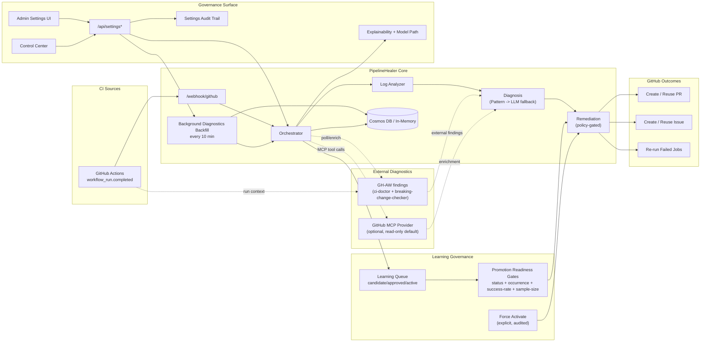

# PipelineHealer

<!-- LAST_VERIFIED: db5ad51 -->

> Policy-aware CI/CD remediation platform for GitHub Actions failures.

[](https://ca-canepro-ph-frontend.kinddune-53ac219d.eastus2.azurecontainerapps.io)
[](https://azure.microsoft.com)
[](LICENSE)

PipelineHealer ingests failed workflow runs, diagnoses root causes, and applies policy-aware remediation:
- deterministic fixes can open or reuse pull requests
- ambiguous or risky cases open structured issues instead of unsafe edits
- every action is auditable, explainable, and traceable to run evidence


## Why this project

CI failures create repetitive triage work. PipelineHealer shortens time-to-understanding with controlled automation:
- multi-agent flow (analyze -> diagnose -> remediate)
- safety-first defaults (`HEAL_MODE=safe`)
- explainability (`diagnosis_source`, reason codes, evidence)
- universal failure context (`failing_job`, `failing_step`, `failing_command`, `signal`)
- artifact idempotency (find-or-create PR/issue reuse)
- task-level model routing (`analysis`, `diagnosis`, `remediation`) with provider-default fallback
- learning queue governance with promotion-readiness gates and audited force activation
- operator UX for fast triage (Dashboard snapshot, Activity Detail deep evidence, sectioned Control Center governance)

This repository started as a hackathon submission baseline and continues as an actively maintained open-source release line.

## Current Release Baseline (v0.2.11)

- Release baseline: [`v0.2.11`](https://github.com/Canepro/pipelinehealer/releases/tag/v0.2.11)
- Historical submission baseline: `v0.2.9`
- Deployment model: Azure-first, using immutable release images (`bash scripts/ph.sh deploy:release --release-version vX.Y.Z`)
- Operator docs: `docs/DEMO_SCRIPT.md`, `docs/LOCAL_DEMO_RUNBOOK.md`, `docs/RELEASE_RUNBOOK.md`

## Kubernetes Install Status (Important)

As of **February 23, 2026**, Kubernetes/Helm setup exists, but random-user "clone + helm install" is **not yet guaranteed** in every environment.

Why:
- image pull success depends on registry/package accessibility from cluster nodes
- Helm can report `STATUS: deployed` while pods still fail to start

What failure looks like:
- pod status: `ErrImagePull` / `ImagePullBackOff`
- pod events: registry token failures like `401 Unauthorized` or `403 Forbidden`

Treat Kubernetes as random-user-ready only after the pullability gate in `docs/KUBERNETES_HELM_RUNBOOK.md` passes on a clean cluster.
Tracking issue: [#37](https://github.com/Canepro/pipelinehealer/issues/37).

### Evidence from a real incident

PipelineHealer already caught and classified a real release-pipeline failure end to end:
- Activity: `f92ee7d9-dd2f-4e32-8edd-c2b44ee0cae3`
- Workflow run: `#22163136636` (version/tag mismatch)
- Incident issue: [#15](https://github.com/Canepro/pipelinehealer/issues/15)
- Case-study PR: [#16](https://github.com/Canepro/pipelinehealer/pull/16)
- Full write-up: [`docs/case-studies/release-tag-mismatch-22163136636.md`](docs/case-studies/release-tag-mismatch-22163136636.md)
- Corrective release: [`v0.2.1`](https://github.com/Canepro/pipelinehealer/releases/tag/v0.2.1)

Azure is the default deployment path for hackathon requirements, but the runtime is portable:
- backend API commands can target any reachable backend via `PH_BACKEND_URL`
- model provider can be Azure OpenAI or OpenAI-compatible (`LLM_PROVIDER`)
- Kubernetes is supported via Helm as a secondary deployment target (`charts/pipelinehealer`) with GHCR-first image defaults
  - registry pullability remains a release gate for random-user installs; do not treat successful Helm output alone as proof

## Architecture



## Hackathon status

- Public repo + live Azure deployment
- Multi-agent implementation with explainability and governance
- Demo flow and operator runbooks documented
- Team: currently maintained by a solo builder (Canepro / Vincent)
- Collaboration welcome: open an issue or PR proposal, and align implementation to a target version in `docs/FUTURE_PLAN.md`

## Documentation

### Start here
- [Feature Guides](docs/features/README.md) — dedicated per-feature usage docs (beginner to expert)
- [Local + Azure Runbook](docs/LOCAL_DEMO_RUNBOOK.md) — full setup and operations
- [CLI Reference](docs/CLI.md) — canonical `scripts/ph.sh` command reference
- [API Reference](docs/API.md) — endpoints, models, auth, best practices

### Additional
- [Demo Script](docs/DEMO_SCRIPT.md)
- [Logs & Investigation](docs/LOGS_AND_INVESTIGATION.md)
- [Model Provider Strategy](docs/MODEL_PROVIDER_STRATEGY.md)
- [Model Provider Switch Runbook](docs/MODEL_PROVIDER_SWITCH_RUNBOOK.md)
- [Learning System Plan](docs/LEARNING_SYSTEM_PLAN.md)
- [Kubernetes Helm Runbook](docs/KUBERNETES_HELM_RUNBOOK.md)
- [Release Runbook](docs/RELEASE_RUNBOOK.md)
- [Case Studies](docs/case-studies/release-tag-mismatch-22163136636.md)
- [Changelog](CHANGELOG.md)
- [Settings & Policy Feature Guide](docs/features/03-settings-and-policy-controls.md)
- [Explainability & Observability Guide](docs/features/05-explainability-and-observability.md)
- [Future Plan](docs/FUTURE_PLAN.md)
- [Contributing](CONTRIBUTING.md)
- [Security](SECURITY.md)
- [Docs Index](docs/README.md)

## Quick start

1. Copy env template:
```bash
cp backend/.env.example backend/.env
```

2. Set minimum required values in `backend/.env`:
- Pick one LLM path:
  - Azure OpenAI:
    - `AZURE_OPENAI_ENDPOINT`
    - `AZURE_OPENAI_DEPLOYMENT_NAME`
    - `AZURE_OPENAI_API_KEY`
  - OpenAI-compatible:
    - `LLM_PROVIDER=openai_compatible`
    - `OPENAI_COMPATIBLE_BASE_URL`
    - `OPENAI_COMPATIBLE_MODEL`
    - `OPENAI_COMPATIBLE_API_KEY`
- Set GitHub access token:
  - `GITHUB_PERSONAL_ACCESS_TOKEN`

3. Run locally (host-native):
```bash
cd backend
uv pip install --system -e ".[dev]"
uvicorn src.main:app --reload
```

```bash
cd frontend
bun install
bun run dev
```

For full local and Docker paths, use `docs/LOCAL_DEMO_RUNBOOK.md`.

### Required vs Optional (For New Repo Users)

If someone installs PipelineHealer from this repo, these are the practical setup paths:

| Setup path | Required | Not required |
|---|---|---|
| Basic local install (recommended first run) | Python/Bun/GitHub CLI, one LLM provider path, `GITHUB_PERSONAL_ACCESS_TOKEN` | All `ENTRA_*`, all `VITE_ENTRA_*` |
| Entra login in UI (`Use Login Session`) | Backend auth config (`AUTH_MODE=entra` or `hybrid` + `ENTRA_*`), frontend build with `VITE_AUTH_MODE=entra` + required `VITE_ENTRA_*` | `X-Admin-Key` for session-auth flows |
| Release maintainer publishing Entra-enabled images | GitHub release environment vars: `VITE_AUTH_MODE=entra`, `VITE_ENTRA_CLIENT_ID`, `VITE_ENTRA_API_SCOPE`, and `VITE_ENTRA_AUTHORITY` or `VITE_ENTRA_TENANT_ID` | Custom redirect/logout vars unless needed by your tenant setup |

Important:
- Entra is optional for adopting PipelineHealer.
- `AUTH_MODE=hybrid` supports both key headers and Entra bearer sessions in the same deployment (recommended during migration/testing).
- `VITE_*` values are build-time frontend inputs; changing them requires a new release image.

## One-command ops

From repo root:

```bash
bash scripts/ph.sh help
bash scripts/ph.sh settings:check
bash scripts/ph.sh settings:persist:verify --from-settings --skip-redeploy
bash scripts/ph.sh settings:persist --repos-add owner/repo1,owner/repo2 --skip-redeploy
bash scripts/ph.sh deploy:release --release-version vX.Y.Z
bash scripts/ph.sh deploy:env
bash scripts/ph.sh status
bash scripts/ph.sh logs
bash scripts/ph.sh demo:e2e
```

Use full command docs for flags and troubleshooting: `docs/CLI.md`.
For repo allowlist safety: use `--repos-add` / `--repos-remove` by default; reserve `--repos-replace` for intentional full replacement (tracked in [#38](https://github.com/Canepro/pipelinehealer/issues/38)).

## `ph.sh` Platform Notes

`scripts/ph.sh` is a bash-first operator CLI.

- Recommended: Linux, macOS, or Windows via WSL2.
- Windows PowerShell-only environments are not first-class for `ph.sh` today.
  - Alternative: run equivalent `az`/`gh` commands and backend API calls from `docs/API.md`.
- Kubernetes deploy is intentionally outside `ph.sh` right now.
  - Alternative: `helm` + `kubectl` via `docs/KUBERNETES_HELM_RUNBOOK.md`.

## New Operator Checklist (After Deploy)

If someone new just got access to a deployed environment, use this 5-step proof path.

1. Set backend URL and check health:
```bash
BACKEND_URL="https://<your-backend-url>"
curl -sS "$BACKEND_URL/health"
```
Expected: `{"status":"healthy"}`.

2. Validate runtime settings visibility:
```bash
PH_BACKEND_URL="$BACKEND_URL" bash scripts/ph.sh settings:check
```
PowerShell-only fallback: call `GET /api/settings` directly (see `docs/API.md`) with required auth headers.

3. Validate GitHub access + target repo:
```bash
gh auth status
gh repo view <owner>/<repo> >/dev/null
```

4. Trigger one deterministic failure:
```bash
gh workflow run ci.yml -R <owner>/<repo> -f failure_type=dependency
```

5. Verify PipelineHealer outcome:
```bash
bash scripts/ph.sh demo:proof --repo <owner>/<repo> --limit 5
```
Expected: new activity plus a remediation PR or a structured issue (depending on policy/failure type).

For exact command-level setup and troubleshooting, use:
- `docs/LOCAL_DEMO_RUNBOOK.md`
- `docs/CLI.md`

## MCP clarity (quick check)

If you are asking "is MCP actually working?", use this rule:
- `MCP Tool Calls > 0` in Activity Detail means direct MCP tools were invoked for that activity.
- `MCP Tool Calls = 0` does not automatically mean broken MCP. In passive `gh_aw` mode, diagnostics can still be ingested without direct MCP tool calls.
- In hybrid mode (`GH_AW_INGESTION_MODE=hybrid`), both GH-AW and MCP findings can appear in the same activity.
- Check `Source Attribution` + `source_selection_path` to see the path per finding (`gh_aw_passive`, `github_mcp_direct`, or `github_mcp_blocked`).
- For a terminal proof run from CLI, use `bash scripts/ph.sh demo:e2e --strict` and review the printed MCP summary counters.

## Versioning and release

Project versions are synchronized across:
- `VERSION`
- `backend/pyproject.toml`
- `frontend/package.json`
- `charts/pipelinehealer/Chart.yaml` (`version` + `appVersion`)

Release helpers:

```bash
bash scripts/release_preflight.sh
bash scripts/release_checklist.sh minor   # optional dry-run command list
bash scripts/release.sh minor
bash scripts/release_verify.sh vX.Y.Z
```

Tag-based release publishing is automated by `.github/workflows/release.yml` on `vX.Y.Z` tags.
Each release tag publishes immutable GHCR images for backend/frontend using both `vX.Y.Z` and `X.Y.Z` tags, plus digest references in `release_images.md` (ACR publish remains optional for Azure promotion flows).
Recommended Azure promotion command after release: `bash scripts/ph.sh deploy:release --release-version vX.Y.Z`.

## Security and governance defaults

- `HEAL_MODE=safe`
- execution and action controls are independent:
  - `AUTO_APPLY_REMEDIATION` = global execution gate (`false` means plan-only dry-run)
  - `AUTO_CREATE_PR`, `AUTO_CREATE_ISSUE`, `AUTO_RETRY_WORKFLOW` = per-action toggles
- scoped repo allowlists for remediation
- protected admin settings API with audit trail
- settings UI uses one-step `Save & Persist` for durable config updates
- Settings + Control Center expose the same runtime controls for operator verification
- Entra + API key auth modes (`api_key`, `entra`, `hybrid`)
- MCP defaults are safe (`MCP_ENABLED=false`, `MCP_READ_ONLY=true`)
