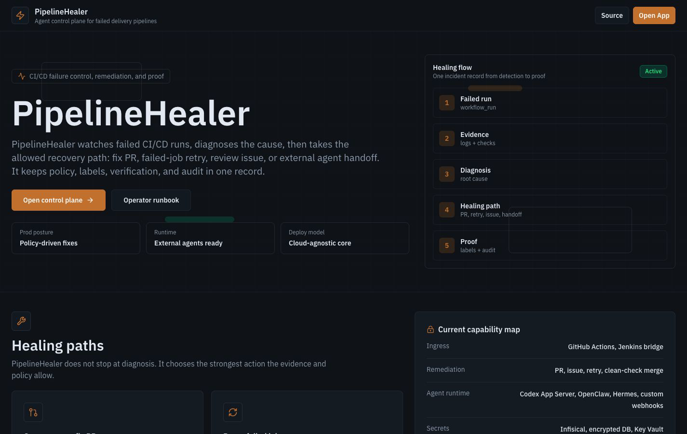
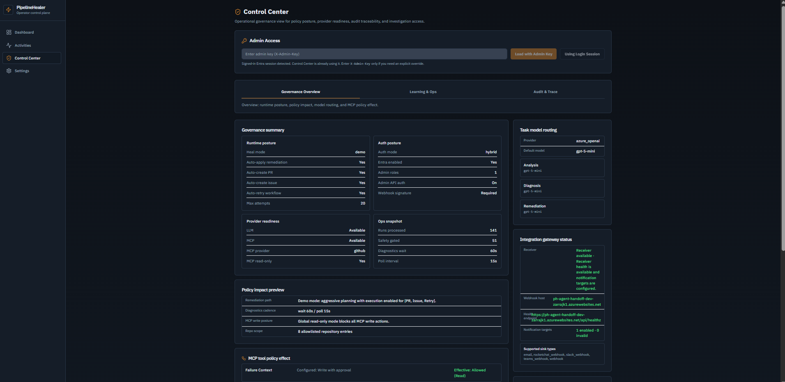
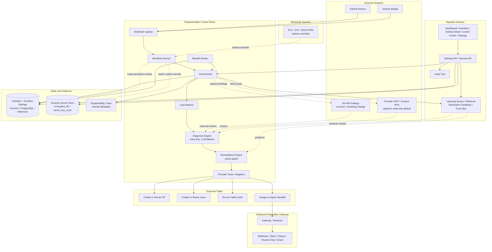
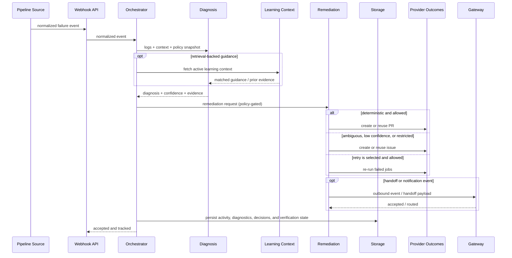

# PipelineHealer

<!-- LAST_VERIFIED: ac1b1ec -->

> OSS-first, policy-aware pipeline remediation platform for failed delivery workflows.

[](https://ca-canepro-ph-frontend.kinddune-53ac219d.eastus2.azurecontainerapps.io)
[](https://youtu.be/9iv5ZMKYzts)
[](https://azure.microsoft.com)
[](LICENSE)

PipelineHealer ingests failed pipeline runs, normalizes the failure context, diagnoses likely root causes, and chooses a policy-safe remediation path.

- deterministic cases can create or reuse pull requests
- ambiguous or risky cases fall back to structured issues
- every outcome stays explainable, auditable, and tied to concrete run evidence

Today, the native ingress path is GitHub Actions, with a signed Jenkins bridge for Jenkins-first environments. Azure Container Apps is the reference managed deployment, but not the product boundary.




## Why It Exists

Pipeline failures create repetitive triage work and slow delivery. PipelineHealer is designed to reduce that loop without hiding uncertainty behind AI-shaped prose.

- analyze -> diagnose -> remediate
- keep configured policy separate from effective runtime behavior
- prefer deterministic evidence and bounded automation over opaque autonomy
- keep review-first paths explicit when confidence is low or policy blocks action

## Why this matters for real teams

- Reduces repetitive CI failure triage without hiding uncertainty.
- Keeps remediation decisions reviewable and auditable.
- Supports mixed environments, with GitHub Actions native and a Jenkins bridge path.
- Separates policy intent from runtime behavior so operators can trust outcomes.

## Current status

- Published OSS release line through [`v0.7.2`](https://github.com/Canepro/pipelinehealer/releases/tag/v0.7.2).
- Working demo and walkthrough video are publicly available.
- Native GitHub Actions path is active, and the Jenkins integration kit is documented and reusable.
- Current phase: validation and hardening of operator workflows and policy controls.

## What You Get

- Normalized incident records with `failing_job`, `failing_step`, `failing_command`, and evidence layers.
- Deterministic-first diagnosis and remediation, with structured LLM fallback where needed.
- Activity Detail as an incident workspace, including verification feedback for identification, diagnosis, remediation, and guidance effectiveness.
- Control Center operator views for governance posture, learning explainability, trust ops, and audit/trace.
- UI-first operator settings: runtime-safe controls save durably from Settings, secrets rotate through a separate write-only path, and setup checklists expose missing bootstrap wiring.
- Honest runtime boundary reporting: env stays the bootstrap override path, and GitHub App inputs are stored for readiness only until live App auth ships.
- Durable audit trails for settings changes and remediation decisions.
- OSS-friendly storage options: PostgreSQL, Cosmos DB, or in-memory mode for local development.
- Portable runtime secret baseline: `encrypted_db` works across cloud/self-hosted deployments; `azure_key_vault` is an optional Azure-native integration, not a required secret model.

## Current Scope

- Native provider path: GitHub Actions
- Bridge path: Jenkins
- Reference managed deployment: Azure Container Apps
- Demo video: [YouTube walkthrough](https://youtu.be/9iv5ZMKYzts)
- Latest published release: [`v0.7.2`](https://github.com/Canepro/pipelinehealer/releases/tag/v0.7.2)
- Detailed release history: [CHANGELOG.md](CHANGELOG.md)

## Jenkins Integration Kit

PipelineHealer now ships a reusable Jenkins integration kit for OSS and
Jenkins-first environments under
[integrations/jenkins-bridge/](integrations/jenkins-bridge/README.md).

What it provides:

- signed bridge sender assets you can drop into `.jenkins/scripts/`
- a plugin-free shell capture helper for direct failure excerpts
- a small install script for repeatable repo onboarding
- a documented rollout path from repo-local scripts to a Shared Library model

Recommended Jenkins baseline:

- no extra plugin required for the supported shell-capture path
- Shared Libraries if you want org-wide reuse
- avoid `currentBuild.rawBuild` or other script-approval-heavy patterns for
  routine bridge evidence capture

Example remediation stories:

| Path | Evidence |
|------|----------|
| Cross-repo operator-reviewed path | Issue: [rocketchat-app-logs-viewer#16](https://github.com/Canepro/rocketchat-app-logs-viewer/issues/16) -> Fix PR: [rocketchat-app-logs-viewer#17](https://github.com/Canepro/rocketchat-app-logs-viewer/pull/17) |
| Deterministic auto-fix demo path | Diagnostics: [pipelinehealer-demo#122](https://github.com/Canepro/pipelinehealer-demo/issues/122) -> Tracking issue: [pipelinehealer-demo#120](https://github.com/Canepro/pipelinehealer-demo/issues/120) -> Auto-generated fix PR: [pipelinehealer-demo#121](https://github.com/Canepro/pipelinehealer-demo/pull/121) |

## Quick Start

For first-time evaluation, use the local developer path with API-key auth and safe-mode defaults.

1. Create the backend env file:

```bash
cp backend/.env.example backend/.env
```

2. Set only the minimum required values in `backend/.env`:
- one LLM path (`AZURE_OPENAI_*` or `OPENAI_COMPATIBLE_*`)
- `GITHUB_PERSONAL_ACCESS_TOKEN`

3. Start the backend:

```bash
cd backend
uv venv .venv
source .venv/bin/activate  # Windows: .venv\Scripts\activate
uv pip install -e ".[dev]"
uvicorn src.main:app --reload --port 8000
```

If `uv` is not installed yet, see the installation guide at <https://docs.astral.sh/uv/getting-started/installation/>.

4. Start the frontend:

```bash
cd frontend
bun install
bun run dev
```

5. Verify the app:
- `curl -sS http://127.0.0.1:8000/health`
- open `http://127.0.0.1:5173`
- open `/app/settings` to confirm the setup checklist and manage runtime-safe settings or write-only secrets
- use `Save` to persist runtime-safe non-secret changes immediately; environment values remain the startup override path for forced/bootstrap settings
- treat GitHub App fields as readiness/configuration signals for now; the live GitHub API runtime still uses a personal access token

Beginner-safe defaults already exist in `.env.example`:
- `HEAL_MODE=safe`
- `AUTH_MODE=api_key`
- `VITE_AUTH_MODE=none`
- `STORAGE_MODE=memory`

For full local, Azure, and demo operations, use [docs/runbooks/LOCAL_DEMO_RUNBOOK.md](docs/runbooks/LOCAL_DEMO_RUNBOOK.md).

## Deployment Paths

### Azure Container Apps

Reference managed deployment commands:

```bash
bash scripts/ph.sh deploy:env
bash scripts/ph.sh deploy:release --release-version vX.Y.Z
bash scripts/ph.sh status
```

Use `deploy:release` when promoting a published release. Use full `deploy` only when rebuilding from local source is intentional.

A manual Terraform equivalent of the Azure Bicep stack is available at [infra/terraform/README.md](infra/terraform/README.md). The current `scripts/ph.sh` and `azd` flows still provision from `infra/main.bicep`.

### Kubernetes / Helm

```bash
helm upgrade --install pipelinehealer ./charts/pipelinehealer \
  --namespace pipelinehealer \
  --create-namespace \
  -f values.production.yaml
```

Then verify:

```bash
kubectl -n pipelinehealer rollout status deploy/pipelinehealer-backend
kubectl -n pipelinehealer rollout status deploy/pipelinehealer-frontend
```

### Local Containers

```bash
docker compose --env-file backend/.env build backend frontend
docker compose --env-file backend/.env up -d backend frontend
```

Optional local durable storage:
- PostgreSQL: `docker compose --profile postgres up -d postgres`
- Cosmos emulator: `docker compose --profile cosmos up -d cosmos-emulator`

## Runtime Expectations

PipelineHealer is still useful without a healthy LLM path, but it is not operating at full product value.

- Full capability:
  - live analysis, diagnosis, and remediation succeed
  - deterministic fix paths can produce PRs when policy allows
  - bounded patch drafting remains schema- and validation-gated
- Degraded mode:
  - ingestion, evidence collection, audit, and fallback issue creation still work
  - diagnosis/remediation quality drops

Important operator rule:
- provider configuration alone does not prove full capability
- verify live model compatibility before demos or production promotion

Validated Azure note:
- as of `v0.7.2`, the strongest validated Azure path for `gpt-5.1-codex-mini` uses the `cognitiveservices.azure.com` base endpoint with the Responses-first runtime path

Detailed runtime contract: [docs/architecture/LLM_AND_AGENT_RUNTIME.md](docs/architecture/LLM_AND_AGENT_RUNTIME.md)

## Operator Workflow

The operator surface is intentionally split by job:

- Dashboard: high-level flow, safety gating, failure mix, and recent activity posture
- Activities: searchable run history
- Activity Detail: incident record, evidence layers, remediation result, external diagnostics, and verification feedback
- Control Center: governance overview, learning explainability, trust ops, and audit/trace
- Settings: immediate durable runtime controls, write-only secrets, and bootstrap wiring/readiness

Settings intent:
- normal operator changes belong in the product surface and persist immediately
- env is reserved for bootstrap wiring, forced overrides, and deployment-managed secrets
- `POST /api/settings/persist` remains only as a deprecated compatibility path for older CLI/env-sync flows




## Security and Governance Defaults

- `HEAL_MODE=safe`
- per-action controls for PRs, issues, and retries
- admin settings routes protected by `X-API-Key` plus `X-Admin-Key` in non-development key mode
- signed Jenkins bridge with explicit replay/skew guards
- auditable settings changes and remediation traces
- `MCP_ENABLED=false` and `MCP_READ_ONLY=true` by default

Security policy: [SECURITY.md](SECURITY.md)

## One-Command Operations

From repo root:

```bash
bash scripts/ph.sh help
bash scripts/ph.sh status
bash scripts/ph.sh settings:check
bash scripts/ph.sh deploy:release --release-version vX.Y.Z
bash scripts/ph.sh demo:e2e
bash scripts/ph.sh logs
```

Full CLI reference: [docs/reference/CLI.md](docs/reference/CLI.md)

## Architecture



### Failure Processing Flow



## Versioning and Release

Version sources stay synchronized across:
- `VERSION`
- `backend/pyproject.toml`
- `frontend/package.json`
- `charts/pipelinehealer/Chart.yaml`

Release helpers:

```bash
bash scripts/release_preflight.sh
bash scripts/release_checklist.sh minor
bash scripts/release.sh minor
bash scripts/release_verify.sh vX.Y.Z
```

Important:
- do not tag a release while the notes only exist under `## [Unreleased]`
- `bash scripts/release.sh ...` must run before tagging so `CHANGELOG.md` contains the matching `## [vX.Y.Z] - YYYY-MM-DD` section the release workflow extracts
- after `scripts/release.sh`, commit the generated version/changelog files before pushing the release tag

Release runbook: [docs/runbooks/RELEASE_RUNBOOK.md](docs/runbooks/RELEASE_RUNBOOK.md)

## Documentation Map

- [Docs Index](docs/README.md)
- [Feature Guides](docs/features/README.md)
- [Jenkins Integration Kit](integrations/jenkins-bridge/README.md)
- [API Reference](docs/reference/API.md)
- [CLI Reference](docs/reference/CLI.md)
- [Operator Control Plane](docs/architecture/OPERATOR_CONTROL_PLANE.md)
- [Local + Azure Runbook](docs/runbooks/LOCAL_DEMO_RUNBOOK.md)
- [Kubernetes Helm Runbook](docs/runbooks/KUBERNETES_HELM_RUNBOOK.md)
- [Logs & Investigation](docs/runbooks/LOGS_AND_INVESTIGATION.md)
- [Changelog](CHANGELOG.md)

## Contributing

Contributions are welcome.

- workflow and quality gates: [CONTRIBUTING.md](CONTRIBUTING.md)
- repo-specific delivery rules: [AGENTS.md](AGENTS.md)

When proposing changes, include target-version intent in [docs/FUTURE_PLAN.md](docs/FUTURE_PLAN.md) and release-note intent in [CHANGELOG.md](CHANGELOG.md).
