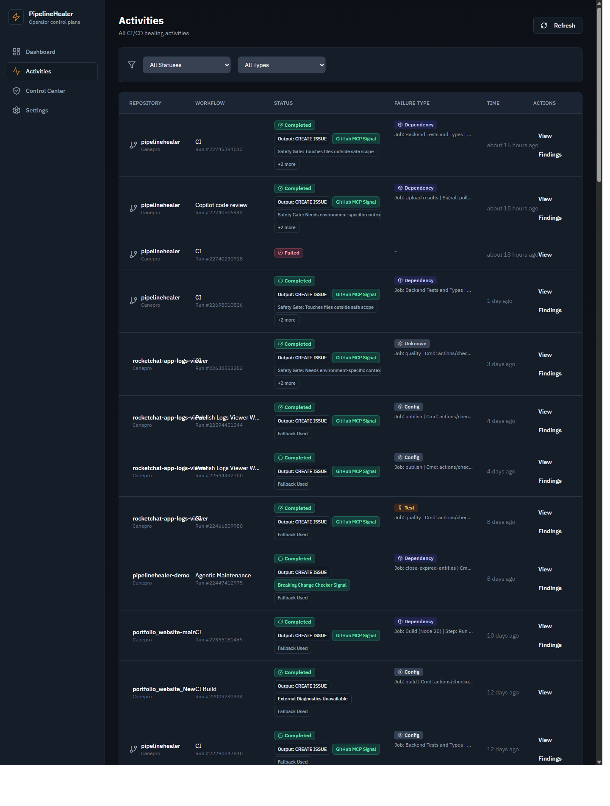
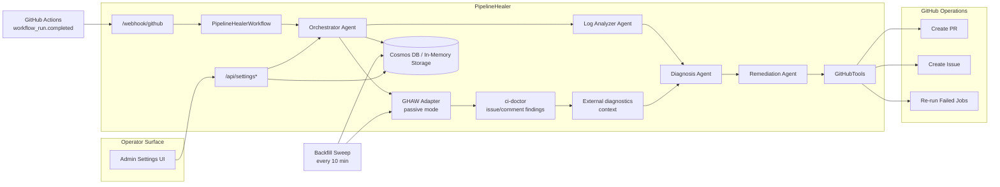
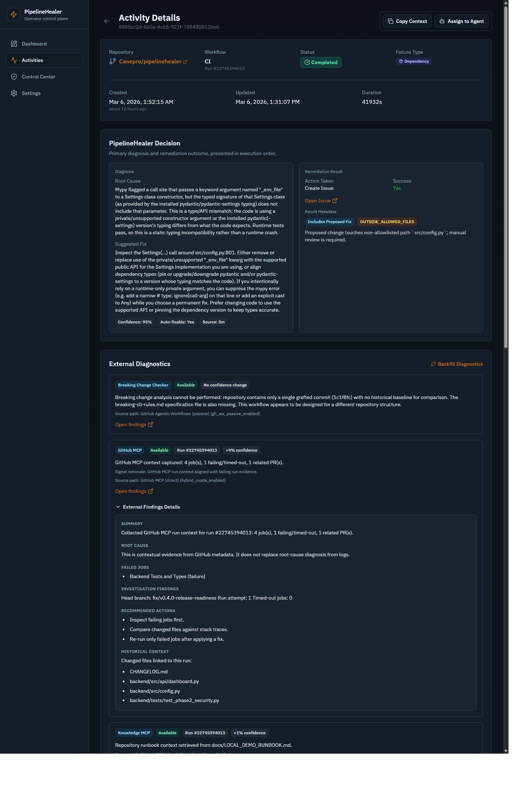

# PipelineHealer

<!-- LAST_VERIFIED: 41d30eb -->

> Self-Healing CI/CD Agent System powered by Microsoft Agent Framework

[](https://ca-canepro-ph-frontend.kinddune-53ac219d.eastus2.azurecontainerapps.io)
[](https://azure.microsoft.com)
[](LICENSE)

PipelineHealer is an AI-powered multi-agent system that automatically detects, diagnoses, and remediates CI/CD pipeline failures in GitHub Actions workflows. When a workflow fails, PipelineHealer analyzes the logs, classifies the failure, and either opens a fix PR for high-confidence issues or creates a structured GitHub Issue for everything else.


## Documentation

| Doc | What it covers |
|-----|---------------|
| [API Reference](docs/API.md) | Endpoints, auth, data models, best practices |
| [CLI Reference](docs/CLI.md) | `scripts/ph.sh` commands, flags, env overrides |
| [Local & Azure Runbook](docs/LOCAL_DEMO_RUNBOOK.md) | Detailed E2E setup and operations |
| [Contributing](CONTRIBUTING.md) | PR guidelines, quality gates, docs policy |
| [Security](SECURITY.md) | Vulnerability reporting, secret hygiene |
| [Future Plan](docs/FUTURE_PLAN.md) | Post-hackathon roadmap |

## One-Command Operations

From repo root:

```bash
bash scripts/ph.sh help
```

For the full CLI reference (all commands, flags, error handling, env overrides), see `docs/CLI.md`.

**Works locally and on Azure** (set `PH_BACKEND_URL` for local):

```bash
bash scripts/ph.sh settings:check                                  # view runtime settings
bash scripts/ph.sh settings:audit --limit 5                        # view admin audit trail
bash scripts/ph.sh audit:proof --limit 5                           # create traceable audit entries
bash scripts/ph.sh logs                                            # backend logs (filtered)
bash scripts/ph.sh logs:grep --pattern "error"                     # grep backend logs
bash scripts/ph.sh backfill                                        # trigger diagnostics backfill
bash scripts/ph.sh demo:proof --repo Canepro/pipelinehealer-demo   # show PRs/issues for a repo
bash scripts/ph.sh demo:reset                                      # reset demo fixtures
```

```bash
# Local mode — prefix with PH_BACKEND_URL to target localhost:
PH_BACKEND_URL=http://127.0.0.1:8000 bash scripts/ph.sh settings:check
```

**Azure-only** (requires an Azure deployment — prints a clear error if `PH_BACKEND_URL` is set):

```bash
bash scripts/ph.sh deploy                                            # build, push, update Azure apps
bash scripts/ph.sh deploy:env                                        # sync env vars only (no rebuild)
bash scripts/ph.sh urls                                              # print Azure backend/frontend URLs
bash scripts/ph.sh status                                            # Container App status + replicas
bash scripts/ph.sh warm                                              # disable scale-to-zero for demos
bash scripts/ph.sh lowcost                                           # re-enable scale-to-zero
bash scripts/ph.sh demo:e2e                                          # full Azure E2E demo flow
bash scripts/ph.sh rollout:canary --repos owner/repo1,owner/repo2    # canary onboarding (issue-only)
bash scripts/ph.sh webhook:add --repo owner/repo1                    # add Azure webhook for a repo
bash scripts/ph.sh webhook:disable --repo owner/repo1                # disable Azure webhook for a repo
```

## What Problem This Solves

CI failures often force teams into repetitive, low-signal triage loops. PipelineHealer reduces that operational drag by turning failed runs into structured, actionable outputs:

- deterministic PRs for bounded, high-confidence fixes
- review-ready issues for ambiguous or policy-gated cases
- one-click drilldown from dashboard summary to specific evidence and artifacts

This shortens time-to-understanding without requiring blind automation.

## Why This Is Safe To Trust

PipelineHealer prioritizes governed remediation over unchecked autonomy:

- **Safety gating**: policy boundaries are explicit (for example allowlist scope), with reason codes visible in UI.
- **Explainability panels**: each selected activity surfaces failure type, confidence, proposed action, reason code, and evidence lines.
- **Request-id propagation**: responses include trace identifiers so actions can be correlated across UI and backend logs.
- **Admin audit trail**: settings changes are recorded with old/new diffs, actor fingerprints, and trace data (`/api/settings/audit`).

## What Uses AI vs Pure Logic

PipelineHealer intentionally mixes deterministic logic with LLM calls.

**AI** (Azure OpenAI via Microsoft Agent Framework):

- Log summarization — condense raw job logs into a short, structured summary.
- Diagnosis fallback — when pattern rules do not confidently match, the model produces a structured `Diagnosis` JSON.
- Remediation narrative — write high-quality PR/issue bodies and root-cause descriptions (the actual file edits are still deterministic).

**Pure logic:**

- Webhook ingestion, event routing, idempotency checks.
- Log extraction (fetch jobs + logs), error/warning line heuristics.
- Pattern-based diagnosis for common cases (dependency/lint/test/timeout/build-config patterns).
- Remediation execution (create branch, commit file content, create PR/issue, rerun failed jobs).
- API client fallback caching: class-level flag so the first Responses API 400 switches all agents to the Chat fallback with zero repeated round-trips.
- LLM transient-error retry: automatic exponential backoff with jitter for 429/5xx errors from Azure OpenAI, preventing transient rate-limit or gateway failures from aborting the pipeline.

## Healing Modes

`HEAL_MODE` controls how aggressive the system is. Set it in `backend/.env` or toggle at runtime via `PATCH /api/settings`.

| Mode | Behavior |
|------|----------|
| `safe` (recommended) | Conservative, production-stable. PRs for high-confidence fixes only; issues for everything else. |
| `demo` | More aggressive. Retries flaky tests, opens PRs that bump workflow timeouts, etc. |
| `debug` | Same behavior as `safe`, but emits verbose logging at each pipeline step (diagnosis path, step timings, which OpenAI client was used). |

## Overview

When a GitHub Actions workflow fails, PipelineHealer:

1. **Detects** the failure via webhook
2. **Analyzes** the build logs using AI
3. **Diagnoses** the root cause (dependency issues, test failures, lint errors, etc.)
4. **Remediates** by creating a fix PR or detailed issue



## Architecture



## Features

- **Multi-Agent Architecture**: Specialized agents for log analysis, diagnosis, and remediation
- **Intelligent Diagnosis**: Pattern-based and AI-powered root cause analysis with robust JSON extraction
- **Automated Remediation**: Creates PRs for auto-fixable issues, detailed issues for others
- **Professional Dashboard UI**: Shadcn-style component system with polished dashboard/activity states
- **Admin Settings Surface**: Admin-key-protected runtime settings page (`/settings`) with durable overrides persisted to Cosmos DB
- **Effective Runtime Policy Banner**: Read-only trust surface for current mode, PR toggle, webhook signature state, and allowlist scope
- **Repo Scope Visibility**: Settings page shows `PH_ALLOWED_REPOS` summary and explicit repository list with add/remove controls
- **Admin Audit Visibility**: Explicit-load audit panel with request IDs, actor fingerprints, and old/new setting diffs
- **Settings Persistence**: One-click "Persist Settings" saves mutable runtime config to Cosmos DB; auto-restored on startup
- **Runtime Model Switching**: Change Azure OpenAI deployment name via settings UI with immediate agent cache invalidation
- **GitHub Agentic Workflows Integration**: Passive ingestion of external diagnostics (ci-doctor) when available on monitored repos
- **Bounded External Diagnostics Polling**: Passive ingestion waits up to ~8 minutes and performs a final immediate fetch before timeout classification
- **Async External Diagnostics Backfill**: Background sweep (every 10 min) enriches completed activities whose ci-doctor findings arrived after the original poll window; manual trigger via `POST /api/backfill-diagnostics`
- **Deep Content Enrichment**: Structured extraction of ci-doctor issue bodies — summary, root cause, recommended actions, historical context, doctor engine/model metadata — stored in `external_diagnostics[].metadata.details`
- **External Findings Panel**: Collapsible UI panel rendering enriched ci-doctor findings with markdown formatting, section truncation, and auto-expand for available diagnostics



- **Stale Activity Recovery**: Activities interrupted by container restarts (scale-to-zero, redeploy) are automatically marked failed on startup with a clear explanation instead of remaining stuck forever
- **Capability-Aware Remediation**: Graceful handling when target repos have issues or PRs disabled — remediation returns a `SKIP` with a user-friendly reason code instead of a confusing HTTP error
- **Smart External Diagnostics Polling**: Skips ci-doctor polling when the failed workflow is itself a known gh-aw workflow, preventing unnecessary 8-minute wait windows
- **Mobile Navigation Reliability**: Route-safe, notch-safe sheet navigation for portrait mobile workflows
- **Route-Level Code Splitting**: Each page loads as a separate chunk via `React.lazy`, reducing initial bundle size
- **Enterprise Ready**: Azure-native with full observability and security

## Deterministic Fix Matrix

The remediation policy is intentionally conservative: deterministic, bounded edits create PRs; lower-confidence cases create issues.

| Failure Signal (example) | Deterministic Action | Confidence | Output |
|---|---|---|---|
| `Cannot find module 'left-pad'` | Add missing dependency in manifest | High | PR |
| `ESLint could not find eslint.config.js` | Add deterministic ESLint flat-config scaffold | High | PR |
| `Code style issues found` / formatter violations | Apply formatter/lint autofix in bounded scope | High | PR |
| `403 Resource not accessible by integration` | Patch minimal workflow permissions block | High | PR |
| Workflow timeout exceeded (`timeout-minutes`) | Bounded timeout bump for known workflow file (demo mode) | Medium-High | PR |
| Test assertions failing | Summarize failures + rerun guidance | Low | Issue |
| External service failures (`ECONNREFUSED`, auth) | Structured diagnosis + operator next steps | Low | Issue |

Issue output may include a `Proposed Fix (For Review Only)` section. These patches are suggestions for human review and are never auto-applied.

**Reason codes** for non-auto-applied issue suggestions:

| Code | Meaning |
|------|---------|
| `LOW_CONFIDENCE` | Confidence score is below auto-remediation threshold |
| `AMBIGUOUS_RESOLUTION` | Multiple valid remediations detected; human choice required |
| `OUTSIDE_ALLOWED_FILES` | Suggested change touches files outside the safe allowlist |
| `REQUIRES_ENV_CONTEXT` | Fix depends on repository/environment context not available at runtime |
| `SAFETY_BOUND` | Blocked by configured safety constraints or mode restrictions |

**Output artifact codes** (diagnosis succeeded, but artifact publication was constrained):

| Code | Meaning |
|------|---------|
| `OUTPUT_ISSUES_DISABLED` | Target repo has issues disabled |
| `OUTPUT_PRS_DISABLED` | Target repo has PRs disabled |
| `OUTPUT_REPO_READ_ONLY` | Target repo is archived or read-only |
| `OUTPUT_REPO_ARCHIVED` | Target repo is archived |
| `OUTPUT_PERMISSION_DENIED` | PAT or app lacks write permission |

## Safety Model

PipelineHealer is built for controlled remediation, not unconstrained autonomous edits.

- Allowed edit domains:
  - dependency manifests / lockfile-adjacent deterministic updates
  - lint/format remediation outputs
  - bounded workflow YAML adjustments for known CI failure patterns
- Explicitly not modified automatically:
  - application business logic
  - secrets and credential material
- Server-side scope enforcement:
  - `PH_ALLOWED_REPOS` allowlist is enforced in the webhook handler to prevent unintended PAT-wide or org-wide actions
- Operational bounds:
  - one remediation result per activity
  - capped retry and timeout controls via env settings
  - issue fallback when confidence is not sufficient for safe PR generation
- Human-in-the-loop:
  - PRs are reviewable artifacts; safe mode favors conservative, auditable changes

## Technology Stack

### Backend (Python + UV)
- **Microsoft Agent Framework** - Multi-agent orchestration
- **Azure OpenAI** - Configurable model deployment (for example `gpt-4o`, `gpt-4o-mini`, `gpt-5-mini`)
- **FastAPI** - API framework
- **Azure Cosmos DB** - Activity storage

### Frontend (TypeScript + Bun)
- **React 18** - UI framework
- **TanStack Query** - Data fetching
- **Recharts** - Visualization
- **Tailwind CSS** - Styling

### Infrastructure
- **Azure Container Apps** - Hosting
- **Azure Container Registry (ACR)** - Backend/frontend image hosting
- **Azure Application Insights** - Observability (OpenTelemetry spans: `pipeline.process`, `pipeline.step.analyze`, `pipeline.step.diagnose`, `pipeline.step.remediate`)
- **GitHub Webhooks + REST API** - Workflow events and remediation actions

## Quick Start

### Prerequisites

- Python 3.11+
- [uv](https://docs.astral.sh/uv/) (recommended) or pip
- [Bun](https://bun.sh/) (for the frontend)
- An Azure OpenAI resource **with a deployed model** (see setup below)
- A [GitHub Personal Access Token](https://docs.github.com/en/authentication/keeping-your-account-and-data-secure/managing-your-personal-access-tokens) with `repo` and `workflow` scopes

### Step 1 — Set Up Azure OpenAI (Required)

PipelineHealer uses Azure OpenAI for log summarization, failure diagnosis, and remediation narratives. Without it, the pipeline cannot process failures.

1. **Create an Azure OpenAI resource** — In the [Azure Portal](https://portal.azure.com), search for *Azure OpenAI* and create a new resource (any region; `East US 2` and `Sweden Central` usually have the widest model availability).
2. **Deploy a model** — Open your resource, go to **Model deployments** → **Manage Deployments** (this opens Azure AI Foundry). Click **Deploy model** → **Deploy base model** and deploy a chat model (for example `gpt-4o` or `gpt-4o-mini`). Note the **deployment name** you choose.
3. **Copy your credentials** — Back in the Azure Portal resource page:
   - **Endpoint**: found under *Keys and Endpoint* (for example `https://your-resource.openai.azure.com/`).
   - **API Key**: Key 1 or Key 2 from the same page.

> **Tip:** If your resource uses the older `cognitiveservices.azure.com` domain, that works too — PipelineHealer auto-detects the endpoint style.

### Step 2 — Configure Environment

1. **Clone the repository**
   ```bash
   git clone https://github.com/Canepro/pipelinehealer.git
   cd pipelinehealer
   ```

2. **Create your `.env` file**
   ```bash
   cp backend/.env.example backend/.env
   ```

3. **Fill in the required values** — Open `backend/.env` in your editor and set at minimum:
   ```dotenv
   # Azure OpenAI (from Step 1)
   AZURE_OPENAI_ENDPOINT=https://your-resource.openai.azure.com/
   AZURE_OPENAI_DEPLOYMENT_NAME=gpt-4o          # must match your deployment name
   AZURE_OPENAI_API_KEY=your-key-here            # Key 1 or Key 2

   # GitHub
   GITHUB_PERSONAL_ACCESS_TOKEN=ghp_xxxxxxxxxxxx # PAT with repo + workflow scopes
   ```

   Everything else has sensible defaults for local development. See the full [Environment Variables](#environment-variables) table below for optional tuning.

### Step 3 — Run Locally

**Option A: Host-native (simplest)**

1. **Backend**
   ```bash
   cd backend
   uv pip install --system -e ".[dev]"
   uvicorn src.main:app --reload
   ```

2. **Frontend**
   ```bash
   cd frontend
   bun install
   bun run dev
   ```

3. **Verify**
   - Backend health: http://127.0.0.1:8000/health
   - Dashboard: open the URL printed by Vite (usually http://127.0.0.1:5173)
     - `Dashboard`: `/`
     - `Activities`: `/activities`
     - `Settings`: `/settings` (admin-only runtime configuration; requires `X-Admin-Key`)

**Option B: Containerized (Docker or Podman)**

```bash
docker compose --env-file backend/.env build backend frontend
docker compose --env-file backend/.env up -d backend frontend
docker compose --env-file backend/.env ps
curl -sS http://127.0.0.1:8000/health
```

> **Podman users:** Replace `docker compose` with `podman compose` in all commands above. Everything else is the same.

Pass `--env-file backend/.env` with compose commands to avoid empty-env warnings.

Optional: include the Cosmos DB emulator for persistent storage locally:

```bash
docker compose --env-file backend/.env up -d backend frontend cosmos-emulator
```

Container URLs: Frontend `http://127.0.0.1:3000`, Backend `http://127.0.0.1:8000/health`.

> Note: The frontend container uses `BACKEND_UPSTREAM` (defaults to `http://backend:8000` via `docker-compose.yml`). If backend API auth is enabled, also set `API_AUTH_KEY` for the frontend — Nginx forwards it as `X-API-Key` to `/api/*`.

> **Local vs Azure:** Local dev runs on `127.0.0.1` via `docker compose` or host-native processes. Azure dev runs in Container Apps with public URLs. Both paths work independently — Azure issues do not block local testing.

## End-to-End Demo

For the full demo flow (backend + webhook forwarding + `gh workflow run` triggers), see `docs/LOCAL_DEMO_RUNBOOK.md`.

For Azure-hosted demos, use the one-command runner:

```bash
bash scripts/ph.sh demo:e2e
```

Useful options:

```bash
# Skip webhook sync if already configured
bash scripts/ph.sh demo:e2e --skip-webhook-sync

# Only reset fixtures
bash scripts/ph.sh demo:reset

# Faster verify window for repeated test runs
bash scripts/ph.sh demo:e2e --wait-seconds 120
```

## Deploy to Azure

```bash
# Using Azure Developer CLI
# 1) complete docs/PREDEPLOY_PLACEHOLDER_AUDIT.md
# 2) set required runtime secrets for infra/main.bicepparam
azd env set API_AUTH_KEY "<strong-api-key>"
azd env set ADMIN_API_KEY "<strong-admin-key>"
azd env set GITHUB_WEBHOOK_SECRET "<github-webhook-secret>"
azd env set GITHUB_PERSONAL_ACCESS_TOKEN "<github-pat>"
# 3) then deploy
azd up
```

## Redeploy After Code Changes

If you already have Azure resources provisioned, use one command:

```bash
bash scripts/ph.sh deploy
```

Important:
- Run with `bash ...` (execute), not `. scripts/...` or `source scripts/...`.

What this does:

- Builds and pushes backend/frontend images
- Updates both Container Apps
- Syncs backend runtime env from `backend/.env` (including `MAX_REMEDIATION_ATTEMPTS` and related tuning keys)
- Verifies backend health and admin settings endpoint

Sync env vars only (no image rebuild):

```bash
bash scripts/ph.sh deploy:env
```

Notes:

- `deploy:env` syncs backend runtime env (including `AUTH_MODE`, `ENTRA_*`, and mutable policy settings).
- Frontend `VITE_*` auth values are build-time inputs. If you change `VITE_AUTH_MODE` / `VITE_ENTRA_*`, run full `bash scripts/ph.sh deploy` to rebuild frontend.

Common options:

```bash
# Background deploy that survives terminal restarts
bash scripts/ph.sh deploy:bg

# Follow background deploy logs
bash scripts/ph.sh deploy:logs

# Check background deploy status
bash scripts/ph.sh deploy:status

# See all one-command options
bash scripts/ph.sh help

# Use a specific container engine (default: auto-detect)
bash scripts/ph.sh deploy --engine docker
bash scripts/ph.sh deploy --engine podman
```

## Scale To Zero (What It Means)

Container Apps can automatically scale down to `0` running instances when there is no traffic.

- Good: saves money.
- Tradeoff: first request after idle can be slow (cold start), because Azure needs to start a container again.

This affects Azure-hosted URLs only, not your local `docker compose` stack.

Check current min replicas:

```bash
bash scripts/ph.sh status
```

Keep apps warm during demos (disable scale-to-zero temporarily):

```bash
bash scripts/ph.sh warm
```

Re-enable low-cost behavior after demo:

```bash
bash scripts/ph.sh lowcost
```

## Configuration

### Environment Variables

| Variable | Description | Required |
|----------|-------------|----------|
| `AZURE_OPENAI_ENDPOINT` | Azure OpenAI endpoint URL | Yes |
| `AZURE_OPENAI_DEPLOYMENT_NAME` | Model deployment name (for example `gpt-4o`, `gpt-4o-mini`, `gpt-5-mini`) | Yes |
| `AZURE_OPENAI_API_VERSION` | API version for the primary Responses client (default: `2025-04-01-preview`) | Optional |
| `AZURE_OPENAI_CHAT_API_VERSION` | API version for the fallback Chat Completions client (default: `2024-12-01-preview`) | Optional |
| `COSMOS_DB_ENDPOINT` | Cosmos DB endpoint (in-memory fallback used when empty) | Optional (prod) |
| `GITHUB_WEBHOOK_SECRET` | Webhook signature secret | Yes (prod) |
| `GITHUB_PERSONAL_ACCESS_TOKEN` | GitHub PAT for API access | Yes |
| `API_AUTH_KEY` | Required `X-API-Key` value for `/api/*` in non-development envs | Yes (non-dev) |
| `ADMIN_API_KEY` | Required `X-Admin-Key` value for admin settings endpoints (`GET/PATCH /api/settings`) | Yes (recommended in all envs) |
| `AUTH_MODE` | API auth mode: `api_key`, `entra`, or `hybrid` | Optional (default: `api_key`) |
| `ENTRA_TENANT_ID` | Entra tenant ID used for OIDC validation (when `AUTH_MODE=entra|hybrid`) | Required for Entra mode |
| `ENTRA_CLIENT_ID` | App/client ID used for backend audience defaults | Required for Entra mode |
| `ENTRA_ALLOWED_AUDIENCES` | Accepted JWT audiences (CSV or JSON array). Defaults to `api://<ENTRA_CLIENT_ID>,<ENTRA_CLIENT_ID>` | Optional |
| `ENTRA_ISSUER` | Optional issuer override (otherwise derived from tenant) | Optional |
| `ENTRA_JWKS_URL` | Optional JWKS URL override (otherwise derived from tenant) | Optional |
| `ENTRA_ADMIN_ROLES` | Role/scope names allowed for admin settings endpoints (CSV or JSON array) | Optional (default includes `PipelineHealer.Admin`) |
| `AUDIT_SALT` | Optional salt used to derive admin actor fingerprints for settings-audit records | Optional |
| `VERIFY_WEBHOOK_SIGNATURE` | Enable webhook signature verification | Recommended `true` |
| `VERIFY_WEBHOOK_SIGNATURE_IN_DEVELOPMENT` | Enforce signature checks in development too | Optional |
| `CORS_ALLOWED_ORIGINS` | Exact CORS origins (CSV or JSON array) | Optional |
| `CORS_ALLOW_ORIGIN_REGEX` | Regex for dynamic hosts (for example Azure Container Apps) | Optional |
| `PIPELINE_STEP_TIMEOUT_SECONDS` | Per-step orchestration timeout (analyze/diagnose/remediate) | Optional |
| `GITHUB_API_MAX_RETRIES` | Retries for transient GitHub API failures (429/5xx/network) | Optional |
| `GITHUB_API_RETRY_BASE_SECONDS` | Base retry backoff delay | Optional |
| `GITHUB_API_RETRY_MAX_SECONDS` | Max retry backoff delay | Optional |
| `LOG_PROMPT_MAX_CHARS` | Max log characters sent to model prompt | Optional |
| `LOG_PROMPT_HEAD_CHARS` | Head chars preserved when truncating prompt logs | Optional |
| `LOG_PROMPT_TAIL_CHARS` | Tail chars preserved when truncating prompt logs | Optional |
| `PH_ALLOWED_REPOS` | Optional repo allowlist (CSV or JSON array of `owner/repo`) for webhook processing scope | Optional |
| `GH_AW_TOOLS_ENABLED` | Enable GitHub Agentic Workflows integration (`true`/`false`) | Optional |
| `GH_AW_INGESTION_MODE` | gh-aw ingestion mode: `disabled` or `passive` | Optional |
| `GH_AW_KNOWN_WORKFLOWS` | Known gh-aw workflow names (CSV, e.g. `ci-doctor,schema-consistency-checker`) | Optional |
| `VITE_AUTH_MODE` | Frontend auth mode: `none` or `entra` | Optional (default: `none`) |
| `VITE_ENTRA_TENANT_ID` | Frontend Entra tenant ID (or use `VITE_ENTRA_AUTHORITY`) | Required for Entra login |
| `VITE_ENTRA_CLIENT_ID` | Frontend Entra SPA client ID | Required for Entra login |
| `VITE_ENTRA_AUTHORITY` | Optional Entra authority override (`https://login.microsoftonline.com/<tenant>`) | Optional |
| `VITE_ENTRA_API_SCOPE` | API delegated scope requested by frontend (for Bearer token) | Required for Entra login |
| `VITE_ENTRA_REDIRECT_URI` | Optional frontend redirect URI override | Optional |
| `VITE_ENTRA_POST_LOGOUT_REDIRECT_URI` | Optional logout redirect URI override | Optional |
| `VITE_API_AUTH_KEY` | Frontend API key header value (`X-API-Key`) when calling protected `/api/*` routes | Optional |

`VITE_*` values are compile-time frontend build inputs (Vite), not live runtime toggles.

### API Security

- `AUTH_MODE=api_key` (default): legacy headers (`X-API-Key` and `X-Admin-Key`) are used.
- `AUTH_MODE=entra`: `/api/*` requires `Authorization: Bearer <token>`, and admin settings routes require an Entra admin role/scope from `ENTRA_ADMIN_ROLES`.
- `AUTH_MODE=hybrid`: either Bearer token **or** API keys are accepted (useful during rollout/migration).
- In `development`, auth bypass remains only for `AUTH_MODE=api_key` to preserve local iteration.
- In `production`, keep `VERIFY_WEBHOOK_SIGNATURE=true` and set `GITHUB_WEBHOOK_SECRET`.
- Entra token validation accepts both tenant-scoped issuer formats commonly seen in Microsoft tokens:
  - `https://login.microsoftonline.com/<tenant>/v2.0`
  - `https://sts.windows.net/<tenant>/`

### Entra Setup

For full beginner-friendly, click-by-click Entra setup (app registrations, scopes/roles, redirect URIs, consent, env vars), plus troubleshooting and real issues encountered during this rollout, see:

- `docs/LOCAL_DEMO_RUNBOOK.md` -> **Optional: Enable Entra login (frontend + backend)** -> **Beginner-friendly Entra portal checklist**

Example:

```bash
# API-key mode (legacy)
curl -H "X-API-Key: $API_AUTH_KEY" "http://127.0.0.1:8000/api/activities?limit=20"

# Entra mode
curl -H "Authorization: Bearer $ACCESS_TOKEN" "http://127.0.0.1:8000/api/activities?limit=20"
```

Admin settings examples:

```bash
# API-key mode
curl -H "X-API-Key: $API_AUTH_KEY" -H "X-Admin-Key: $ADMIN_API_KEY" "http://127.0.0.1:8000/api/settings"

curl -X PATCH \
  -H "X-API-Key: $API_AUTH_KEY" \
  -H "X-Admin-Key: $ADMIN_API_KEY" \
  -H "Content-Type: application/json" \
  -d '{"heal_mode":"safe","pipeline_step_timeout_seconds":120}' \
  "http://127.0.0.1:8000/api/settings"

# Entra mode (requires role in ENTRA_ADMIN_ROLES)
curl -H "Authorization: Bearer $ACCESS_TOKEN" "http://127.0.0.1:8000/api/settings"

curl -H "X-API-Key: $API_AUTH_KEY" -H "X-Admin-Key: $ADMIN_API_KEY" "http://127.0.0.1:8000/api/settings/audit?limit=20"
```

One-command equivalents (recommended for demos/operators):

```bash
bash scripts/ph.sh settings:check
bash scripts/ph.sh settings:audit --limit 20
bash scripts/ph.sh audit:proof --limit 5
```

Audit trail notes:

- `/api/settings/audit` entries are persisted to Cosmos DB (with in-memory fallback for local development).
- Entries include `request_id`, actor fingerprint (`admin_key:sha256:<short>`), changed keys, and old/new values.
- Entries survive backend restarts and redeployments when Cosmos DB storage is available.

### GitHub Webhook Setup

1. Create a GitHub App or use a webhook on your repository
2. Set the webhook URL to `https://your-app.azurecontainerapps.io/webhook/github`
3. Select the `workflow_run` event
4. Set the webhook secret (match `GITHUB_WEBHOOK_SECRET`)
5. Keep `VERIFY_WEBHOOK_SIGNATURE=true` in non-development environments
6. Keep only one active `workflow_run` hook per environment path (local smee OR Azure direct)
7. Verify delivery status after setup:

```bash
gh api repos/<owner>/<repo>/hooks --jq '.[] | {id,active,url:.config.url,last_response:.last_response.code,events}'
```

For Azure mode, the active hook should point to `https://<backend-fqdn>/webhook/github` and recent deliveries should show `200`.

### Real-Repo Canary Rollout (Issue-Only First)

Use this when attaching PipelineHealer to real repositories outside the demo fixture repo:

```bash
# Set repo allowlist + safe mode + disable auto-PRs, then sync env and attach hooks
bash scripts/ph.sh rollout:canary --repos owner/repo1,owner/repo2
```

Default `rollout:canary` behavior:

- Sets `PH_ALLOWED_REPOS` to the provided repo list
- Sets `HEAL_MODE=safe`
- Sets `AUTO_CREATE_PR=false` (issue-only observation mode)
- Runs env-only Azure sync
- Adds/updates Azure `workflow_run` webhooks for each listed repo

Optional: keep PR creation enabled while still using repo allowlist and webhook automation:

```bash
bash scripts/ph.sh rollout:canary --repos owner/repo1,owner/repo2 --allow-prs
```

### Demo Note: Repeated Runs

If you repeatedly trigger the same dependency/lint failure without merging prior fix PRs, remediation may fail with:

- `422 Unprocessable Entity` on `POST /repos/.../git/refs`

This usually means the target fix branch already exists (for example `fix/update-left-pad` or `fix/lint-eslint-config`).

## Project Structure

```
pipelinehealer/
├── backend/                 # Python backend
│   ├── src/
│   │   ├── agents/         # AI agents (base, diagnosis, log_analyzer, orchestrator, remediation)
│   │   ├── api/            # FastAPI routes (dashboard, webhook, deps)
│   │   ├── tools/          # GitHub tools, fix generators
│   │   ├── workflows/      # Agent workflow orchestration
│   │   ├── config.py       # Env-driven settings (singleton)
│   │   ├── storage.py      # Cosmos DB + in-memory storage
│   │   └── main.py         # Application entry point
│   └── pyproject.toml      # Python dependencies
├── frontend/               # React frontend
│   ├── src/
│   │   ├── components/     # UI components (incl. settings/ sub-components)
│   │   ├── pages/          # Page components
│   │   └── api/            # API client
│   └── package.json        # Node dependencies
├── infra/                  # Azure Bicep templates
├── demo-repo/              # Demo repository for testing
└── README.md
```

## Try It Out

Use the included `demo-repo/` fixtures or the public demo repository [`Canepro/pipelinehealer-demo`](https://github.com/Canepro/pipelinehealer-demo).

Fastest path (Azure deployment required):

```bash
bash scripts/ph.sh demo:e2e --wait-seconds 120
```

Manual path:

1. Configure webhook delivery to PipelineHealer (`/webhook/github`)
2. Trigger workflow dispatch for failure scenarios
3. Verify PR/issue outputs and dashboard activities

See `docs/LOCAL_DEMO_RUNBOOK.md` for full step-by-step instructions.

## Live Instance

A live Azure deployment is available for evaluation:

- Frontend: [PipelineHealer UI](https://ca-canepro-ph-frontend.kinddune-53ac219d.eastus2.azurecontainerapps.io)
- Backend: [Health check](https://ca-canepro-ph-backend.kinddune-53ac219d.eastus2.azurecontainerapps.io/health)
- Example artifacts: [PR #91](https://github.com/Canepro/pipelinehealer-demo/pull/91) (dependency fix), [Issue #90](https://github.com/Canepro/pipelinehealer-demo/issues/90) (tracking issue)

> The live instance uses scale-to-zero. First request after idle may be slow (cold start).

## License

MIT License — see [LICENSE](LICENSE) for details.

## Acknowledgments

- Microsoft Agent Framework team
- Azure AI team
- GitHub CLI and GitHub API ecosystem

## Origin

Built for the [AI Dev Days Hackathon 2026](https://devdays.ai/) by [Vincent Mogah](https://learn.microsoft.com/en-us/users/canepro0084/).
