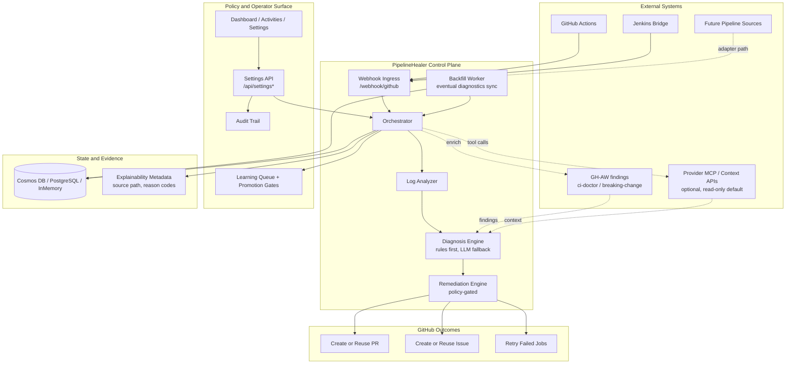
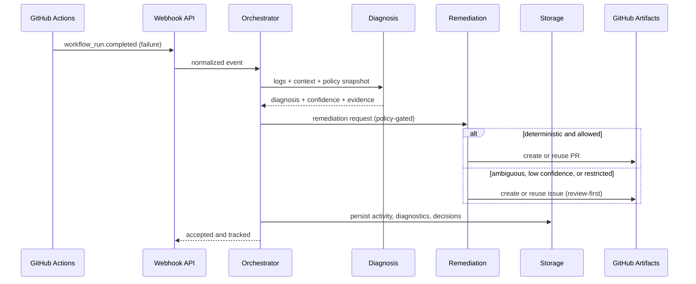

# PipelineHealer

<!-- LAST_VERIFIED: 7280f80 -->

> OSS-first, policy-aware pipeline remediation platform with GitHub Actions and Jenkins bridge support today.

[](https://ca-canepro-ph-frontend.kinddune-53ac219d.eastus2.azurecontainerapps.io)
[](https://azure.microsoft.com)
[](https://github.com/Canepro/pipelinehealer/releases/tag/v0.3.3)
[](LICENSE)

PipelineHealer ingests failed pipeline executions, diagnoses root causes, and applies controlled remediation:
- deterministic fixes open or reuse pull requests
- ambiguous or risky cases open structured issues instead of unsafe edits
- all actions are auditable, explainable, and tied to concrete run evidence

Current provider coverage is GitHub Actions plus a signed Jenkins bridge path. The product boundary is intentionally broader than CI-only tooling: PipelineHealer is designed as a remediation control plane for software-delivery pipelines, with provider-specific ingress and tool adapters around a shared policy, diagnosis, and audit core.


## Hackathon Snapshot

- Public repository: `https://github.com/Canepro/pipelinehealer`
- Live reference deployment: Azure Container Apps (backend + frontend)
- Current release baseline: [`v0.3.3`](https://github.com/Canepro/pipelinehealer/releases/tag/v0.3.3)
- `v0.3.2` required freeze scope shipped: `#36` (Jenkins bridge), `#42` (Assign-to-Agent), `#57` (storage posture hardening)
- OSS-friendly durable storage is available: PostgreSQL adapter (`#58`) alongside Cosmos DB and in-memory development mode
- Current release tracking umbrella: [#44](https://github.com/Canepro/pipelinehealer/issues/44)
- Demo runbook: [docs/DEMO_SCRIPT.md](docs/DEMO_SCRIPT.md)

## Example Remediation Stories

| Path | Evidence |
|------|----------|
| Cross-repo operator-reviewed path (production-style) | Issue: [rocketchat-app-logs-viewer#16](https://github.com/Canepro/rocketchat-app-logs-viewer/issues/16) -> Fix PR: [rocketchat-app-logs-viewer#17](https://github.com/Canepro/rocketchat-app-logs-viewer/pull/17) |
| Deterministic auto-fix path (demo fixture) | Diagnostics: [pipelinehealer-demo#122](https://github.com/Canepro/pipelinehealer-demo/issues/122) -> Tracking issue: [pipelinehealer-demo#120](https://github.com/Canepro/pipelinehealer-demo/issues/120) -> Auto-generated fix PR: [pipelinehealer-demo#121](https://github.com/Canepro/pipelinehealer-demo/pull/121) |

Story flow: PipelineHealer captures failure evidence, opens a traceable issue, and then drives either human-reviewed remediation or deterministic fix PR generation.

## Beginner Path (First 10 Minutes)

For first-time evaluation, start local with default key authentication and no Entra setup.

1. Create env file:

```bash
cp backend/.env.example backend/.env
```

2. In `backend/.env`, set only:
- one LLM path (`AZURE_OPENAI_*` or `OPENAI_COMPATIBLE_*`)
- `GITHUB_PERSONAL_ACCESS_TOKEN`

3. Start backend (Terminal A):

```bash
cd backend
python3 -m venv .venv
source .venv/bin/activate
pip install -e ".[dev]"
uvicorn src.main:app --reload --port 8000
```

4. Start frontend (Terminal B):

```bash
cd frontend
bun install
bun run dev
```

5. Verify:
- `curl -sS http://127.0.0.1:8000/health` returns `{\"status\":\"healthy\"}`
- open `http://127.0.0.1:5173`

Defaults are already beginner-safe in `.env.example`:
- `HEAL_MODE=safe`
- `AUTH_MODE=api_key`
- `VITE_AUTH_MODE=none`
- `STORAGE_MODE=memory` (development default)

For managed deployment and full demo ops, use [docs/LOCAL_DEMO_RUNBOOK.md](docs/LOCAL_DEMO_RUNBOOK.md).

## Product Position

PipelineHealer is open source first.

- Azure Container Apps is the current reference managed deployment, not the definition of the product.
- The core platform should remain understandable and operable across local, Docker, Helm/Kubernetes, ACA, and future deployment targets.
- Provider-specific integrations (GitHub, Jenkins, future pipeline sources) should plug into a shared control plane instead of redefining product behavior per platform.
- Configuration should be deterministic and visible: operators should be able to see what is configured, what is effective, and where that value came from.

## Deployment Command Cheat Sheet

Pick the path that matches your environment:

1. Azure Container Apps (recommended managed path)

```bash
# Runtime/env-only update (no image rebuild)
bash scripts/ph.sh deploy:env

# Promote a published release by tag
bash scripts/ph.sh deploy:release --release-version vX.Y.Z

# Full rebuild + redeploy from local source
bash scripts/ph.sh deploy
```

2. Kubernetes (Helm)

```bash
# Install or update from chart source
helm upgrade --install pipelinehealer ./charts/pipelinehealer \
  --namespace pipelinehealer \
  --create-namespace \
  -f values.production.yaml

# Verify rollout
kubectl -n pipelinehealer rollout status deploy/pipelinehealer-backend
kubectl -n pipelinehealer rollout status deploy/pipelinehealer-frontend
```

3. Local containers (Docker/Podman)

```bash
docker compose --env-file backend/.env build backend frontend
docker compose --env-file backend/.env up -d backend frontend
# Podman: replace `docker compose` with `podman compose`
```

Detailed docs:
- Azure + local operations: [docs/LOCAL_DEMO_RUNBOOK.md](docs/LOCAL_DEMO_RUNBOOK.md)
- Kubernetes/Helm: [docs/KUBERNETES_HELM_RUNBOOK.md](docs/KUBERNETES_HELM_RUNBOOK.md)
- Full CLI command reference: [docs/CLI.md](docs/CLI.md)

Persistence guardrail for non-development deployments:
- Use a durable backend: `STORAGE_MODE=cosmos` (`COSMOS_DB_ENDPOINT`) or `STORAGE_MODE=postgres` (`POSTGRES_DSN`).
- Non-development startup now fails fast when durable storage is required but missing.
- Explicit non-development in-memory mode is blocked unless you set `ALLOW_IN_MEMORY_STORAGE_IN_NON_DEVELOPMENT=true` for demo/evaluation.

## Why PipelineHealer

Pipeline failures create repetitive triage work and slow delivery. PipelineHealer reduces mean time to understanding and remediation with a safety-first flow:
- Analyze -> Diagnose -> Remediate
- policy gates (`HEAL_MODE`, per-action toggles, repo allowlists)
- explainability fields (`diagnosis_source`, reason codes, source attribution)
- universal failure context (`failing_job`, `failing_step`, `failing_command`, `signal`)
- idempotent artifacts (find-or-create PR/issue reuse)

## Professional Value

- Faster triage: failure context is normalized into consistent signals and evidence.
- Safer automation: deterministic fixes can be auto-proposed while risky paths stay review-first.
- Operational traceability: every action links to run evidence, reason codes, and policy state.
- Deployment flexibility: same control model across Azure, Kubernetes, and local container paths.
- Platform extensibility: provider-specific adapters can expand beyond GitHub-centric CI into broader delivery and operations pipelines.

## Recent Releases

### v0.3.3

- Landing page polish: scroll entrance animations, capability counters, and architecture diagram.
- Release/deploy alignment: frontend package + chart + backend versions synchronized and deployed to ACA.

### v0.3.2

- Signed Jenkins bridge ingestion path for Jenkins-primary CI coverage: `POST /webhook/jenkins`.
- Assign-to-Agent handoff integration (`copy_only` and optional `webhook`) with audited controls.
- Storage posture hardening:
  - non-development fail-fast when durable storage is required but missing
  - explicit non-development in-memory mode requires opt-in
- PostgreSQL durable adapter shipped as OSS-friendly persistence path (`STORAGE_MODE=postgres`, `POSTGRES_DSN`).

### v0.3.1

- Frontend runtime-first config for containerized deployments (`VITE_*` via `/runtime-config.js`).
- No-rebuild config updates through runtime env sync paths (ACA/Helm/compose).
- Release workflow/frontend image decoupled from auth build-arg coupling.

Release notes: [CHANGELOG.md](CHANGELOG.md), [v0.3.3 release](https://github.com/Canepro/pipelinehealer/releases/tag/v0.3.3), [v0.3.2 release](https://github.com/Canepro/pipelinehealer/releases/tag/v0.3.2), and [v0.3.1 release](https://github.com/Canepro/pipelinehealer/releases/tag/v0.3.1)

## Kubernetes Portability Status

As of March 5, 2026 (`v0.3.3`), random-user image pullability regressions are gated in release automation.

- previous portability gap issue [#37](https://github.com/Canepro/pipelinehealer/issues/37) is closed
- Helm success output alone is still not sufficient proof; verify rollout and image pulls on clean clusters
- recommended operator path: use published release images and run release verification gates

Operational runbook: [docs/KUBERNETES_HELM_RUNBOOK.md](docs/KUBERNETES_HELM_RUNBOOK.md)

## Architecture

The diagrams below show system boundaries and runtime decision flow.



### Failure Processing Flow



## Developer Setup (uv Variant)

If you already completed the **Beginner Path**, this is the equivalent backend startup using `uv`:

```bash
cd backend
uv pip install --system -e ".[dev]"
uvicorn src.main:app --reload
```

For full local/Azure/Kubernetes run paths, use [docs/LOCAL_DEMO_RUNBOOK.md](docs/LOCAL_DEMO_RUNBOOK.md).

## One-Command Operations

From repo root:

```bash
bash scripts/ph.sh help
bash scripts/ph.sh status
bash scripts/ph.sh settings:check
bash scripts/ph.sh deploy:release --release-version vX.Y.Z
bash scripts/ph.sh demo:e2e
bash scripts/ph.sh logs
```

Full CLI reference: [docs/CLI.md](docs/CLI.md)

Runtime config notes:
- containerized frontend config (`VITE_*`, including Entra settings) is runtime-driven
- use `bash scripts/ph.sh deploy:env` to apply backend/frontend env changes without rebuilding images
- full `deploy` is only needed when code/image contents changed

## Two-Minute Demo Path

- Recording script: [docs/DEMO_SCRIPT.md](docs/DEMO_SCRIPT.md)
- On-camera E2E command:

```bash
bash scripts/ph.sh demo:e2e --triggers dependency,lint,test,build_config,timeout --wait-seconds 180 --ci-signal-wait-seconds 180
```

- Proof command:

```bash
bash scripts/ph.sh demo:proof --repo <owner>/<repo> --limit 5
```

## Security and Governance Defaults

- `HEAL_MODE=safe`
- independent execution/action toggles:
  - `AUTO_APPLY_REMEDIATION` (global execution gate)
  - `AUTO_CREATE_PR`, `AUTO_CREATE_ISSUE`, `AUTO_RETRY_WORKFLOW` (per-action outputs)
- Jenkins bridge output policy:
  - `JENKINS_BRIDGE_ALLOW_PR=false` keeps signed Jenkins bridge events issue-first by default
  - set `JENKINS_BRIDGE_ALLOW_PR=true` only when you explicitly want bridge-triggered PR output (and `AUTO_CREATE_PR=true`)
- protected settings APIs (`X-API-Key`; admin routes require `X-Admin-Key` in non-development)
- auditable settings changes and remediation traces
- MCP defaults: `MCP_ENABLED=false`, `MCP_READ_ONLY=true`

Security policy: [SECURITY.md](SECURITY.md)

## Versioning and Release

Version sources are synchronized across:
- `VERSION`
- `backend/pyproject.toml`
- `frontend/package.json`
- `charts/pipelinehealer/Chart.yaml` (`version`, `appVersion`)

Release helpers:

```bash
bash scripts/release_preflight.sh
bash scripts/release_checklist.sh minor
bash scripts/release.sh minor
bash scripts/release_verify.sh vX.Y.Z
```

Release runbook: [docs/RELEASE_RUNBOOK.md](docs/RELEASE_RUNBOOK.md)

## Documentation Map

- [Docs Index](docs/README.md)
- [Feature Guides](docs/features/README.md)
- [API Reference](docs/API.md)
- [CLI Reference](docs/CLI.md)
- [Local + Azure Runbook](docs/LOCAL_DEMO_RUNBOOK.md)
- [Kubernetes Helm Runbook](docs/KUBERNETES_HELM_RUNBOOK.md)
- [Logs & Investigation](docs/LOGS_AND_INVESTIGATION.md)
- [Future Plan](docs/FUTURE_PLAN.md)
- [Changelog](CHANGELOG.md)

## Contributing

Contributions are welcome. For workflow, quality gates, and docs policy:
- [CONTRIBUTING.md](CONTRIBUTING.md)
- [AGENTS.md](AGENTS.md)

When proposing changes, include target version alignment (`docs/FUTURE_PLAN.md`) and release-note intent (`Added`, `Changed`, or `Fixed`).
