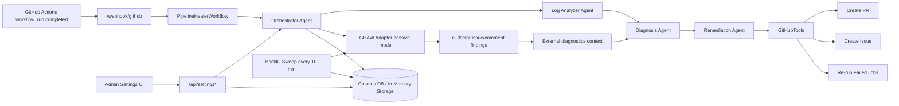

# PipelineHealer

<!-- LAST_VERIFIED: dda4b68 -->

> Self-Healing CI/CD Agent System powered by Microsoft Agent Framework

[](https://azure.microsoft.com)
[](LICENSE)

PipelineHealer is an AI-powered multi-agent system that automatically detects, diagnoses, and remediates CI/CD pipeline failures in GitHub Actions workflows.

PipelineHealer is an Azure-deployed, multi-agent CI remediation system built for the Microsoft AI Dev Days Hackathon, with a local mode provided for fast evaluation and reproducible demos.

## Proof (Azure-First)

- Platform: Azure Container Apps (backend + frontend)
- Live app:
  - Frontend: [PipelineHealer UI](https://ca-canepro-ph-frontend.kinddune-53ac219d.eastus2.azurecontainerapps.io)
  - Backend API: [Backend Base URL](https://ca-canepro-ph-backend.kinddune-53ac219d.eastus2.azurecontainerapps.io)
  - Health endpoint: [GET /health](https://ca-canepro-ph-backend.kinddune-53ac219d.eastus2.azurecontainerapps.io/health)
- Reproducibility:
  - Recording runbook: `docs/DEMO_SCRIPT.md`
  - Full operator runbook: `docs/LOCAL_DEMO_RUNBOOK.md`
- Evidence artifacts:
  - Deterministic PR path: [demo-repo PR #91](https://github.com/Canepro/pipelinehealer-demo/pull/91) (dependency fix)
  - Tracking issue path: [demo-repo Issue #90](https://github.com/Canepro/pipelinehealer-demo/issues/90)
  - ci-doctor enriched findings: [demo-repo Issue #89](https://github.com/Canepro/pipelinehealer-demo/issues/89)
- Runtime verification commands:
  - `bash scripts/ph.sh status`
  - `bash scripts/ph.sh settings:check`
  - Admin audit proof (dual-key): `PATCH /api/settings` + `GET /api/settings/audit`
- Quality gates:
  - Responsive verified at `1280x800`, `1440x900`, `390x844`, `768x1024`
  - No horizontal overflow (`scrollWidth === innerWidth`)
  - Frontend `lint` and `build` passing

Use `bash scripts/ph.sh status` to print current backend/frontend Azure FQDNs before sharing links.

## Documentation Map

- `docs/README.md`: quick index of all project docs
- `docs/API.md`: full API reference — endpoints, auth, data models, best practices
- `docs/CLI.md`: canonical `scripts/ph.sh` CLI reference — all commands, flags, error handling, env overrides
- `docs/DEMO_SCRIPT.md`: single-file recording checklist and 2-minute script
- `docs/LOCAL_DEMO_RUNBOOK.md`: detailed local + Azure E2E operations
- `docs/HACKATHON_LOG.md`: phase status, submission checklist, and milestones
- `docs/GH_AW_IMPLEMENTATION_TRACKER.md`: gh-aw research, Layer 1/2 checklists, and implementation evidence
- `docs/UI_PLAN.md`: UI maturity plan, design principles, and weekly tracking
- `docs/PREDEPLOY_PLACEHOLDER_AUDIT.md`: pre-deploy safety audit
- `docs/FUTURE_PLAN.md`: post-demo and post-hackathon roadmap
- `CONTRIBUTING.md`: contributor workflow and quality gates
- `SECURITY.md`: vulnerability reporting and secret hygiene policy

## One-Command Operations

From repo root:

```bash
bash scripts/ph.sh help
```

For the full CLI reference (all commands, flags, error handling, env overrides), see `docs/CLI.md`.

Common operators:

```bash
bash scripts/ph.sh deploy
bash scripts/ph.sh deploy:env
bash scripts/ph.sh urls
bash scripts/ph.sh status
bash scripts/ph.sh settings:check
bash scripts/ph.sh settings:audit --limit 5
bash scripts/ph.sh settings:persist
bash scripts/ph.sh audit:proof --limit 5
bash scripts/ph.sh logs
bash scripts/ph.sh logs:grep --pattern "debug-mode"
bash scripts/ph.sh demo:e2e
bash scripts/ph.sh demo:proof --repo Canepro/pipelinehealer-demo --limit 10
```

Real-repo onboarding (canary-safe defaults):

```bash
# 1) Configure repo allowlist + issue-only safe mode, then sync Azure runtime env
bash scripts/ph.sh rollout:canary --repos owner/repo1,owner/repo2

# 2) Add/update webhook for one repo (workflow_run only)
bash scripts/ph.sh webhook:add --repo owner/repo1

# 3) Disable Azure webhook for one repo
bash scripts/ph.sh webhook:disable --repo owner/repo1
```

## Submission-Ready Project Description

PipelineHealer is an AI-powered multi-agent system designed to automatically detect, diagnose, and remediate failures in GitHub Actions CI/CD pipelines. It addresses repeated pipeline interruptions by shifting teams from reactive troubleshooting to faster, structured remediation workflows.

The solution is built for DevOps engineers, software developers, and engineering managers who need faster incident triage and clearer operational visibility. When a pipeline fails, PipelineHealer analyzes logs, classifies the failure, and either creates a deterministic fix Pull Request for auto-fixable issues (such as dependency or lint errors) or creates a structured GitHub Issue for failures requiring manual resolution.

PipelineHealer's architecture uses coordinated agents for log analysis, failure diagnosis, remediation, and workflow orchestration. The system leverages technologies including the Microsoft Agent Framework, Azure OpenAI, FastAPI, React/TypeScript, Azure Cosmos DB, Azure Container Apps, Azure Key Vault, and Azure Application Insights. All activity is tracked and visualized in a professional dashboard for real-time transparency and admin controls.

## What Problem This Solves

CI failures often force teams into repetitive, low-signal triage loops. PipelineHealer reduces that operational drag by turning failed runs into structured, actionable outputs:

- deterministic PRs for bounded, high-confidence fixes
- review-ready issues for ambiguous or policy-gated cases
- one-click drilldown from dashboard summary to specific evidence and artifacts

This shortens time-to-understanding without requiring blind automation.

## Why This Is Safe To Trust

PipelineHealer prioritizes governed remediation over unchecked autonomy:

- **Safety gating**: policy boundaries are explicit (for example allowlist scope), with reason codes visible in UI.
- **Explainability panels**: each selected activity surfaces failure type, confidence, proposed action, reason code, and evidence lines.
- **Request-id propagation**: responses include trace identifiers so actions can be correlated across UI and backend logs.
- **Admin audit trail**: settings changes are recorded with old/new diffs, actor fingerprints, and trace data (`/api/settings/audit`).

## What Uses AI vs Pure Logic

PipelineHealer intentionally mixes deterministic logic with LLM calls.

AI (Azure OpenAI via Microsoft Agent Framework):

- Log summarization: condense raw job logs into a short, structured summary.
- Diagnosis fallback: when pattern rules do not confidently match, the model produces a structured `Diagnosis` JSON. A brace-balanced JSON extractor handles markdown fences, nested objects, and LLM commentary robustly.
- Remediation narrative: write high-quality PR/issue bodies and root-cause descriptions (the actual file edits are still deterministic).

Pure logic:

- Webhook ingestion, event routing, idempotency checks.
- Log extraction (fetch jobs + logs), error/warning line heuristics.
- Pattern-based diagnosis for common cases (dependency/lint/test/timeout/build-config patterns).
- Remediation execution (create branch, commit file content, create PR/issue, rerun failed jobs).
- API client fallback caching: class-level flag so the first Responses API 400 switches all agents to the Chat fallback with zero repeated round-trips.
- LLM transient-error retry: automatic exponential backoff with jitter for 429/5xx errors from Azure OpenAI, preventing transient rate-limit or gateway failures from aborting the pipeline.

## Healing Modes

`HEAL_MODE` controls how aggressive the system is:

- `safe` (Recommended): conservative, demo-stable behavior.
- `demo`: more aggressive hackathon-friendly behavior (for example retry flaky test runs, open PRs that bump workflow timeouts when it can patch a known workflow file).
- `debug`: identical behavior to `safe`, but emits verbose diagnostic logging at each pipeline step (log extraction details, pattern vs LLM diagnosis path, step timings, which OpenAI client was used). Toggle via admin `PATCH /api/settings` or env var.

See `backend/.env.example`.

## Overview

When a GitHub Actions workflow fails, PipelineHealer:

1. **Detects** the failure via webhook
2. **Analyzes** the build logs using AI
3. **Diagnoses** the root cause (dependency issues, test failures, lint errors, etc.)
4. **Remediates** by creating a fix PR or detailed issue

## Architecture

### Mermaid Diagram



### ASCII Diagram

```
┌─────────────────┐     ┌──────────────────────────────────────────┐
│  GitHub Actions │     │              PipelineHealer               │
│                 │     │                                          │
│  ┌───────────┐  │     │  ┌─────────┐    ┌───────────────────┐   │
│  │ Workflow  │──┼─────┼─▶│ Webhook │───▶│   Orchestrator    │   │
│  │  Failed   │  │     │  │ Handler │    │      Agent        │   │
│  └───────────┘  │     │  └─────────┘    └───────┬───────────┐    │
│                 │     │                         │           │    │
│  ┌───────────┐  │     │               ┌─────────▼──────┐    │    │
│  │ PR/Issue/ │◀─┼─────┼───────────────│   GitHubTools  │◀───┘    │
│  │ Rerun Ops │  │     │               └─────────┬──────┘         │
│  └───────────┘  │     │                         ▲                │
│                 │     │               ┌─────────┴──────┐         │
└─────────────────┘     │               │  Remediation   │         │
                        │               │     Agent      │         │
                        │               └─────────▲──────┘         │
                        │                         │                │
                        │               ┌─────────┴──────┐         │
                        │               │   Diagnosis    │◀────┐   │
                        │               │     Agent      │     │   │
                        │               └─────────▲──────┘     │   │
                        │                         │            │   │
                        │               ┌─────────┴──────┐     │   │
                        │               │  Log Analyzer  │     │   │
                        │               │     Agent      │     │   │
                        │               └────────────────┘     │   │
                        │               ┌───────────────┐      │   │
                        │               │ GHAW Adapter  │──────┘   │
                        │               │ + ci-doctor   │          │
                        │               │ findings      │          │
                        │               └────────────────┘          │
                        │               ┌──────────────────────────┐│
                        │               │ Cosmos DB (activities,   ││
                        │               │ settings, audit)         ││
                        │               └──────────────────────────┘│
                        │               ┌──────────────────────────┐│
                        │               │ /api/settings* (admin)   ││
                        │               └──────────────────────────┘│
                        └────────────────────────────────────────────┘
```

## Features

- **Multi-Agent Architecture**: Specialized agents for log analysis, diagnosis, and remediation
- **Intelligent Diagnosis**: Pattern-based and AI-powered root cause analysis with robust JSON extraction
- **Automated Remediation**: Creates PRs for auto-fixable issues, detailed issues for others
- **Professional Dashboard UI**: Shadcn-style component system with polished dashboard/activity states
- **Admin Settings Surface**: Admin-key-protected runtime settings page (`/settings`) with durable overrides persisted to Cosmos DB
- **Effective Runtime Policy Banner**: Read-only trust surface for current mode, PR toggle, webhook signature state, and allowlist scope
- **Repo Scope Visibility**: Settings page shows `PH_ALLOWED_REPOS` summary and explicit repository list with add/remove controls
- **Admin Audit Visibility**: Explicit-load audit panel with request IDs, actor fingerprints, and old/new setting diffs
- **Settings Persistence**: One-click "Persist Settings" saves mutable runtime config to Cosmos DB; auto-restored on startup
- **Runtime Model Switching**: Change Azure OpenAI deployment name via settings UI with immediate agent cache invalidation
- **GitHub Agentic Workflows Integration**: Passive ingestion of external diagnostics (ci-doctor) when available on monitored repos
- **Bounded External Diagnostics Polling**: Passive ingestion waits up to ~8 minutes and performs a final immediate fetch before timeout classification
- **Async External Diagnostics Backfill**: Background sweep (every 10 min) enriches completed activities whose ci-doctor findings arrived after the original poll window; manual trigger via `POST /api/backfill-diagnostics`
- **Deep Content Enrichment**: Structured extraction of ci-doctor issue bodies — summary, root cause, recommended actions, historical context, doctor engine/model metadata — stored in `external_diagnostics[].metadata.details`
- **External Findings Panel**: Collapsible UI panel rendering enriched ci-doctor findings with markdown formatting, section truncation, and auto-expand for available diagnostics
- **Mobile Navigation Reliability**: Route-safe, notch-safe sheet navigation for portrait mobile workflows
- **Route-Level Code Splitting**: Each page loads as a separate chunk via `React.lazy`, reducing initial bundle size
- **Enterprise Ready**: Azure-native with full observability and security

## Deterministic Fix Matrix

The remediation policy is intentionally conservative: deterministic, bounded edits create PRs; lower-confidence cases create issues.

| Failure Signal (example) | Deterministic Action | Confidence | Output |
|---|---|---|---|
| `Cannot find module 'left-pad'` | Add missing dependency in manifest | High | PR |
| `ESLint could not find eslint.config.js` | Add deterministic ESLint flat-config scaffold | High | PR |
| `Code style issues found` / formatter violations | Apply formatter/lint autofix in bounded scope | High | PR |
| `403 Resource not accessible by integration` | Patch minimal workflow permissions block | High | PR |
| Workflow timeout exceeded (`timeout-minutes`) | Bounded timeout bump for known workflow file (demo mode) | Medium-High | PR |
| Test assertions failing | Summarize failures + rerun guidance | Low | Issue |
| External service failures (`ECONNREFUSED`, auth) | Structured diagnosis + operator next steps | Low | Issue |

Issue output may include a `Proposed Fix (For Review Only)` section. These patches are suggestions for human review and are never auto-applied.

Reason code legend for non-auto-applied issue suggestions:
- `LOW_CONFIDENCE`: confidence score is below auto-remediation threshold.
- `AMBIGUOUS_RESOLUTION`: multiple valid remediations detected; human choice required.
- `OUTSIDE_ALLOWED_FILES`: suggested change touches files outside the safe allowlist.
- `REQUIRES_ENV_CONTEXT`: fix depends on repository/environment context not available at runtime.
- `SAFETY_BOUND`: blocked by configured safety constraints or mode restrictions.

## Safety Model

PipelineHealer is built for controlled remediation, not unconstrained autonomous edits.

- Allowed edit domains:
  - dependency manifests / lockfile-adjacent deterministic updates
  - lint/format remediation outputs
  - bounded workflow YAML adjustments for known CI failure patterns
- Explicitly not modified automatically:
  - application business logic
  - secrets and credential material
- Server-side scope enforcement:
  - `PH_ALLOWED_REPOS` allowlist is enforced in the webhook handler to prevent unintended PAT-wide or org-wide actions
- Operational bounds:
  - one remediation result per activity
  - capped retry and timeout controls via env settings
  - issue fallback when confidence is not sufficient for safe PR generation
- Human-in-the-loop:
  - PRs are reviewable artifacts; safe mode favors conservative, auditable changes

## Technology Stack

### Backend (Python + UV)
- **Microsoft Agent Framework** - Multi-agent orchestration
- **Azure OpenAI** - Model deployment configurable (`gpt-5-mini` in current dev env)
- **FastAPI** - API framework
- **Azure Cosmos DB** - Activity storage

### Frontend (TypeScript + Bun)
- **React 18** - UI framework
- **TanStack Query** - Data fetching
- **Recharts** - Visualization
- **Tailwind CSS** - Styling

### Infrastructure
- **Azure Container Apps** - Hosting
- **Azure Container Registry (ACR)** - Backend/frontend image hosting
- **Azure Application Insights** - Observability (OpenTelemetry spans: `pipeline.process`, `pipeline.step.analyze`, `pipeline.step.diagnose`, `pipeline.step.remediate`)
- **GitHub Webhooks + REST API** - Workflow events and remediation actions

## Quick Start

### Prerequisites

- Python 3.11+
- Bun (for frontend)
- Azure subscription (for deployment)
- GitHub App or Personal Access Token

### Local Development

1. **Clone the repository**
   ```bash
   git clone https://github.com/Canepro/pipelinehealer.git
   cd pipelinehealer
   ```

2. **Set up the backend**
   ```bash
   cd backend
   cp .env.example .env
   # Edit .env with your configuration
   
   # Install dependencies with UV
   uv pip install --system -e ".[dev]"
   
   # Run the backend
   uvicorn src.main:app --reload
   ```

3. **Set up the frontend**
   ```bash
   cd frontend
   bun install
   bun run dev
   ```

4. **Access the dashboard**
   Open the URL printed by Vite (usually http://127.0.0.1:5173)
   - `Dashboard`: `/`
   - `Activities`: `/activities`
   - `Settings`: `/settings` (admin-only runtime configuration; requires `X-Admin-Key`)

### Local Development (Containerized Stack with Podman/Docker)

Recommended local stack (backend + frontend):

```bash
cp backend/.env.example backend/.env
# edit backend/.env

podman compose --env-file backend/.env build backend frontend
podman compose --env-file backend/.env up -d backend frontend
podman compose --env-file backend/.env ps
curl -sS http://127.0.0.1:8000/health
```

Use `--env-file backend/.env` with compose commands to avoid empty-env warnings.

Optional full container stack (backend + frontend + cosmos emulator):

```bash
podman compose --env-file backend/.env up -d backend frontend cosmos-emulator
podman compose --env-file backend/.env ps
```

Then open:

- Frontend: `http://127.0.0.1:3000`
- Backend health: `http://127.0.0.1:8000/health`

Note:
- Frontend now requires `BACKEND_UPSTREAM` inside the container and defaults to `http://backend:8000` via `docker-compose.yml`.
- If backend API auth is enabled, set `API_AUTH_KEY` for the frontend container too; Nginx forwards it as `X-API-Key` to `/api/*`.

### Local Dev vs Azure Dev

- `Local dev` means services run on your machine (`127.0.0.1`), usually with `podman compose`.
- `Azure dev` means services run in Azure Container Apps with public FQDN URLs.

For hackathon submission, Azure deployment is the primary runtime path.
Local mode is kept as a fast, reproducible evaluation path when Azure is unavailable or when you need rapid iteration.

Important:
- If local backend/frontend containers are running, your local dev is still accessible even if Azure has issues.
- Azure issues do not block local testing.

### End-to-End Demo Runbook

For the exact commands to reproduce the full demo flow (backend + smee.io + `gh workflow run` triggers), see:

- `docs/LOCAL_DEMO_RUNBOOK.md`
- `docs/DEMO_SCRIPT.md` (2-minute recording script + checklist)

For Azure-hosted demos, use the one-command runner (recommended):

```bash
bash scripts/ph.sh demo:e2e
```

Useful options:

```bash
# Skip webhook sync if already configured
bash scripts/ph.sh demo:e2e --skip-webhook-sync

# Only reset fixtures
bash scripts/ph.sh demo:reset

# Faster verify window for repeated test runs
bash scripts/ph.sh demo:e2e --wait-seconds 120
```

### Demo Flow (3-4 Minutes)

1. Dashboard story: show `Processed`, `Actioned`, `Safety Gated`, and `Issue-Only` in one glance.
2. Explainability drilldown: open selected activity details from the snapshot and show reason/evidence context.
3. External findings: expand the "External Findings Details" panel on an enriched activity to show ci-doctor's structured root cause, recommended actions, and historical context.
4. Safety gate rationale: highlight reason-code microcopy and why policy-gated changes become review issues.
5. Audit proof: run `bash scripts/ph.sh audit:proof --limit 5` and show traceable admin change entries.

### Shell Safety For Copy-Paste Blocks

You do **not** need this for every one-line command.

Use it when running long multi-step scripts:

```bash
set -euo pipefail
```

- `-e`: stop if a command fails
- `-u`: fail on unset variables
- `pipefail`: fail a pipeline if any command in it fails

This avoids partial/broken updates during webhook/deploy command blocks.

### Pre-Deploy Placeholder Audit

Before `azd up` or a public release, run the placeholder/dummy-data audit:

- `docs/PREDEPLOY_PLACEHOLDER_AUDIT.md`

### Future Plan

Roadmap and next AI expansions:

- `docs/FUTURE_PLAN.md`

### Deploy to Azure

```bash
# Using Azure Developer CLI
# 1) complete docs/PREDEPLOY_PLACEHOLDER_AUDIT.md
# 2) set required runtime secrets for infra/main.bicepparam
azd env set API_AUTH_KEY "<strong-api-key>"
azd env set ADMIN_API_KEY "<strong-admin-key>"
azd env set GITHUB_WEBHOOK_SECRET "<github-webhook-secret>"
azd env set GITHUB_PERSONAL_ACCESS_TOKEN "<github-pat>"
# 3) then deploy
azd up
```

### Redeploy After Code Changes (Azure Container Apps)

If you already have Azure resources provisioned, use one command:

```bash
bash scripts/ph.sh deploy
```

Important:
- Run with `bash ...` (execute), not `. scripts/...` or `source scripts/...`.

What this does:

- Builds and pushes backend/frontend images
- Updates both Container Apps
- Syncs backend runtime env from `backend/.env` (including `MAX_REMEDIATION_ATTEMPTS` and related tuning keys)
- Verifies backend health and admin settings endpoint

Sync env vars only (no image rebuild):

```bash
bash scripts/ph.sh deploy:env
```

Common options:

```bash
# Background deploy that survives terminal restarts
bash scripts/ph.sh deploy:bg

# Follow background deploy logs
bash scripts/ph.sh deploy:logs

# Check background deploy status
bash scripts/ph.sh deploy:status

# See all one-command options
bash scripts/ph.sh help

# Force Docker engine (if Podman socket is unavailable)
bash scripts/ph.sh deploy --engine docker
```

### Dev Environment Status

The Azure `dev` environment stays reachable until you delete its resource group.

- Backend health: `https://<backend-fqdn>/health`
- Frontend UI: `https://<frontend-fqdn>`

Quick status check:

```bash
bash scripts/ph.sh status
```

### What "Scale To Zero" Means (Plain English)

Container Apps can automatically scale down to `0` running instances when there is no traffic.

- Good: saves money.
- Tradeoff: first request after idle can be slow (cold start), because Azure needs to start a container again.

This affects Azure-hosted URLs only, not your local `podman compose` stack.

Check current min replicas:

```bash
bash scripts/ph.sh status
```

Keep apps warm during demos (disable scale-to-zero temporarily):

```bash
bash scripts/ph.sh warm
```

Re-enable low-cost behavior after demo:

```bash
bash scripts/ph.sh lowcost
```

## Configuration

### Environment Variables

| Variable | Description | Required |
|----------|-------------|----------|
| `AZURE_OPENAI_ENDPOINT` | Azure OpenAI endpoint URL | Yes |
| `AZURE_OPENAI_DEPLOYMENT_NAME` | Model deployment name (for example `gpt-5-mini` or `gpt-4o`) | Yes |
| `AZURE_OPENAI_API_VERSION` | API version for the primary Responses client (default: `2025-04-01-preview`) | Optional |
| `AZURE_OPENAI_CHAT_API_VERSION` | API version for the fallback Chat Completions client (default: `2024-12-01-preview`) | Optional |
| `COSMOS_DB_ENDPOINT` | Cosmos DB endpoint | Yes |
| `GITHUB_WEBHOOK_SECRET` | Webhook signature secret | Yes (prod) |
| `GITHUB_PERSONAL_ACCESS_TOKEN` | GitHub PAT for API access | Yes |
| `API_AUTH_KEY` | Required `X-API-Key` value for `/api/*` in non-development envs | Yes (non-dev) |
| `ADMIN_API_KEY` | Required `X-Admin-Key` value for admin settings endpoints (`GET/PATCH /api/settings`) | Yes (recommended in all envs) |
| `AUDIT_SALT` | Optional salt used to derive admin actor fingerprints for settings-audit records | Optional |
| `VERIFY_WEBHOOK_SIGNATURE` | Enable webhook signature verification | Recommended `true` |
| `VERIFY_WEBHOOK_SIGNATURE_IN_DEVELOPMENT` | Enforce signature checks in development too | Optional |
| `CORS_ALLOWED_ORIGINS` | Exact CORS origins (CSV or JSON array) | Optional |
| `CORS_ALLOW_ORIGIN_REGEX` | Regex for dynamic hosts (for example Azure Container Apps) | Optional |
| `PIPELINE_STEP_TIMEOUT_SECONDS` | Per-step orchestration timeout (analyze/diagnose/remediate) | Optional |
| `GITHUB_API_MAX_RETRIES` | Retries for transient GitHub API failures (429/5xx/network) | Optional |
| `GITHUB_API_RETRY_BASE_SECONDS` | Base retry backoff delay | Optional |
| `GITHUB_API_RETRY_MAX_SECONDS` | Max retry backoff delay | Optional |
| `LOG_PROMPT_MAX_CHARS` | Max log characters sent to model prompt | Optional |
| `LOG_PROMPT_HEAD_CHARS` | Head chars preserved when truncating prompt logs | Optional |
| `LOG_PROMPT_TAIL_CHARS` | Tail chars preserved when truncating prompt logs | Optional |
| `PH_ALLOWED_REPOS` | Optional repo allowlist (CSV or JSON array of `owner/repo`) for webhook processing scope | Optional |
| `GH_AW_TOOLS_ENABLED` | Enable GitHub Agentic Workflows integration (`true`/`false`) | Optional |
| `GH_AW_INGESTION_MODE` | gh-aw ingestion mode: `disabled` or `passive` | Optional |
| `GH_AW_KNOWN_WORKFLOWS` | Known gh-aw workflow names (CSV, e.g. `ci-doctor,schema-consistency-checker`) | Optional |
| `VITE_API_AUTH_KEY` | Frontend API key header value (`X-API-Key`) when calling protected `/api/*` routes | Optional |

### API Security

- `/api/*` endpoints require `X-API-Key` when `ENVIRONMENT` is not `development`.
- `/api/settings` and `/api/settings/audit` use `X-Admin-Key` and, in non-development, also require `X-API-Key`.
- In `development`, API key auth is bypassed for local iteration.
- In `production`, keep `VERIFY_WEBHOOK_SIGNATURE=true` and set `GITHUB_WEBHOOK_SECRET`.

Example:

```bash
curl -H "X-API-Key: $API_AUTH_KEY" "http://127.0.0.1:8000/api/activities?limit=20"
```

Admin settings examples:

```bash
curl -H "X-API-Key: $API_AUTH_KEY" -H "X-Admin-Key: $ADMIN_API_KEY" "http://127.0.0.1:8000/api/settings"

curl -X PATCH \
  -H "X-API-Key: $API_AUTH_KEY" \
  -H "X-Admin-Key: $ADMIN_API_KEY" \
  -H "Content-Type: application/json" \
  -d '{"heal_mode":"safe","pipeline_step_timeout_seconds":120}' \
  "http://127.0.0.1:8000/api/settings"

curl -H "X-API-Key: $API_AUTH_KEY" -H "X-Admin-Key: $ADMIN_API_KEY" "http://127.0.0.1:8000/api/settings/audit?limit=20"
```

One-command equivalents (recommended for demos/operators):

```bash
bash scripts/ph.sh settings:check
bash scripts/ph.sh settings:audit --limit 20
bash scripts/ph.sh audit:proof --limit 5
```

Audit trail notes:

- `/api/settings/audit` entries are persisted to Cosmos DB (with in-memory fallback for local development).
- Entries include `request_id`, actor fingerprint (`admin_key:sha256:<short>`), changed keys, and old/new values.
- Entries survive backend restarts and redeployments when Cosmos DB storage is available.

### GitHub Webhook Setup

1. Create a GitHub App or use a webhook on your repository
2. Set the webhook URL to `https://your-app.azurecontainerapps.io/webhook/github`
3. Select the `workflow_run` event
4. Set the webhook secret (match `GITHUB_WEBHOOK_SECRET`)
5. Keep `VERIFY_WEBHOOK_SIGNATURE=true` in non-development environments
6. Keep only one active `workflow_run` hook per environment path (local smee OR Azure direct)
7. Verify delivery status after setup:

```bash
gh api repos/<owner>/<repo>/hooks --jq '.[] | {id,active,url:.config.url,last_response:.last_response.code,events}'
```

For Azure mode, the active hook should point to `https://<backend-fqdn>/webhook/github` and recent deliveries should show `200`.

### Real-Repo Canary Rollout (Issue-Only First)

Use this when attaching PipelineHealer to real repositories outside the demo fixture repo:

```bash
# Set repo allowlist + safe mode + disable auto-PRs, then sync env and attach hooks
bash scripts/ph.sh rollout:canary --repos owner/repo1,owner/repo2
```

Default `rollout:canary` behavior:

- Sets `PH_ALLOWED_REPOS` to the provided repo list
- Sets `HEAL_MODE=safe`
- Sets `AUTO_CREATE_PR=false` (issue-only observation mode)
- Runs env-only Azure sync
- Adds/updates Azure `workflow_run` webhooks for each listed repo

Optional: keep PR creation enabled while still using repo allowlist and webhook automation:

```bash
bash scripts/ph.sh rollout:canary --repos owner/repo1,owner/repo2 --allow-prs
```

### Demo Note: Repeated Runs

If you repeatedly trigger the same dependency/lint failure without merging prior fix PRs, remediation may fail with:

- `422 Unprocessable Entity` on `POST /repos/.../git/refs`

This usually means the target fix branch already exists (for example `fix/update-left-pad` or `fix/lint-eslint-config`).

## Project Structure

```
pipelinehealer/
├── backend/                 # Python backend
│   ├── src/
│   │   ├── agents/         # AI agents (base, diagnosis, log_analyzer, orchestrator, remediation)
│   │   ├── api/            # FastAPI routes (dashboard, webhook, deps)
│   │   ├── tools/          # GitHub tools, fix generators
│   │   ├── workflows/      # Agent workflow orchestration
│   │   ├── config.py       # Env-driven settings (singleton)
│   │   ├── storage.py      # Cosmos DB + in-memory storage
│   │   └── main.py         # Application entry point
│   └── pyproject.toml      # Python dependencies
├── frontend/               # React frontend
│   ├── src/
│   │   ├── components/     # UI components (incl. settings/ sub-components)
│   │   ├── pages/          # Page components
│   │   └── api/            # API client
│   └── package.json        # Node dependencies
├── infra/                  # Azure Bicep templates
├── demo-repo/              # Demo repository for testing
└── README.md
```

## Hackathon Categories

This project targets:

- **Agentic DevOps Grand Prize** - Automating CI/CD incident response
- **Best Multi-Agent System** - Sophisticated agent orchestration
- **Best Azure Integration** - Native Azure services integration

## Participant

- Solo participant: Vincent Mogah
- Microsoft Learn profile: `https://learn.microsoft.com/en-us/users/canepro0084/`

## Demo

Use the included `demo-repo/` fixtures or the public demo repository `Canepro/pipelinehealer-demo`.
For the fastest path, run from repo root:

```bash
bash scripts/ph.sh demo:e2e --wait-seconds 120
```

If you need manual control, the demo workflow supports dispatch by failure type:

1. Configure webhook delivery to PipelineHealer (`/webhook/github`)
2. Trigger workflow dispatch for failure scenarios
3. Verify PR/issue outputs and dashboard activities

## License

MIT License - see [LICENSE](LICENSE) for details.

## Acknowledgments

- Microsoft Agent Framework team
- Azure AI team
- GitHub CLI and GitHub API ecosystem

---

Built for the AI Dev Days Hackathon 2026
