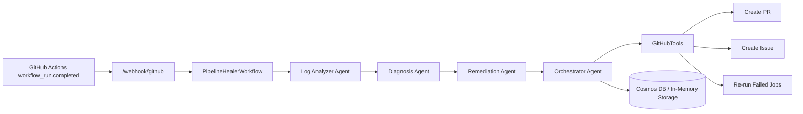

# PipelineHealer

> Self-Healing CI/CD Agent System powered by Microsoft Agent Framework

[](https://azure.microsoft.com)
[](LICENSE)

PipelineHealer is an AI-powered multi-agent system that automatically detects, diagnoses, and remediates CI/CD pipeline failures in GitHub Actions workflows.

## Submission-Ready Project Description

PipelineHealer reduces CI/CD downtime by automating failed-run triage and first-response remediation for GitHub Actions.

When a workflow fails, PipelineHealer receives the `workflow_run.completed` webhook, analyzes logs with a multi-agent pipeline (Log Analyzer, Diagnosis, Remediation, Orchestrator), then performs one of two actions:

- Creates a deterministic fix PR for safe, auto-fixable failures (for example dependency and lint issues)
- Creates a structured tracking issue for non-auto-fixable failures (for example test, build configuration, or timeout failures)

The system includes a professional web dashboard for activity visibility, retry actions, and admin-only runtime controls.

Core technologies: Microsoft Agent Framework, Azure OpenAI, FastAPI, React/TypeScript, Azure Container Apps, Azure Cosmos DB, Azure Key Vault, and Azure Application Insights.

## What Uses AI vs Pure Logic

PipelineHealer intentionally mixes deterministic logic with LLM calls.

AI (Azure OpenAI via Microsoft Agent Framework):

- Log summarization: condense raw job logs into a short, structured summary.
- Diagnosis fallback: when pattern rules do not confidently match, the model produces a structured `Diagnosis` JSON.
- Remediation narrative: write high-quality PR/issue bodies and root-cause descriptions (the actual file edits are still deterministic).

Pure logic:

- Webhook ingestion, event routing, idempotency checks.
- Log extraction (fetch jobs + logs), error/warning line heuristics.
- Pattern-based diagnosis for common cases (dependency/lint/test/timeout/build-config patterns).
- Remediation execution (create branch, commit file content, create PR/issue, rerun failed jobs).

## Healing Modes

`HEAL_MODE` controls how aggressive the system is:

- `safe` (Recommended): conservative, demo-stable behavior.
- `demo`: more aggressive hackathon-friendly behavior (for example retry flaky test runs, open PRs that bump workflow timeouts when it can patch a known workflow file).

See `backend/.env.example`.

## Overview

When a GitHub Actions workflow fails, PipelineHealer:

1. **Detects** the failure via webhook
2. **Analyzes** the build logs using AI
3. **Diagnoses** the root cause (dependency issues, test failures, lint errors, etc.)
4. **Remediates** by creating a fix PR or detailed issue

## Architecture

### Mermaid Diagram



### ASCII Diagram

```
┌─────────────────┐     ┌──────────────────────────────────────────┐
│  GitHub Actions │     │              PipelineHealer               │
│                 │     │                                          │
│  ┌───────────┐  │     │  ┌─────────┐    ┌───────────────────┐   │
│  │ Workflow  │──┼─────┼─▶│ Webhook │───▶│   Orchestrator    │   │
│  │  Failed   │  │     │  │ Handler │    │      Agent        │   │
│  └───────────┘  │     │  └─────────┘    └─────────┬─────────┘   │
│                 │     │                           │             │
│  ┌───────────┐  │     │                 ┌─────────▼─────────┐   │
│  │    PR     │◀─┼─────┼─────────────────│   Log Analyzer    │   │
│  │ Created   │  │     │                 │      Agent        │   │
│  └───────────┘  │     │                 └─────────┬─────────┘   │
│                 │     │                           │             │
│  ┌───────────┐  │     │                 ┌─────────▼─────────┐   │
│  │  Issue    │◀─┼─────┼─────────────────│    Diagnosis      │   │
│  │ Created   │  │     │                 │      Agent        │   │
│  └───────────┘  │     │                 └─────────┬─────────┘   │
│                 │     │                           │             │
└─────────────────┘     │                 ┌─────────▼─────────┐   │
                        │                 │   Remediation     │   │
                        │                 │      Agent        │   │
                        │                 └───────────────────┘   │
                        └──────────────────────────────────────────┘
```

## Features

- **Multi-Agent Architecture**: Specialized agents for log analysis, diagnosis, and remediation
- **Intelligent Diagnosis**: Pattern-based and AI-powered root cause analysis
- **Automated Remediation**: Creates PRs for auto-fixable issues, detailed issues for others
- **Professional Dashboard UI**: Refined visual system for clearer status and activity triage
- **Admin Settings Surface**: Admin-key-protected runtime settings page (`/settings`) with safe in-memory overrides
- **Enterprise Ready**: Azure-native with full observability and security

## Failure Types Supported

| Type | Detection | Auto-Fix |
|------|-----------|----------|
| Dependency Issues | ✅ | ✅ |
| Lint/Format Errors | ✅ | ✅ |
| Test Failures | ✅ | ❌ (creates issue) |
| Build Config Errors | ✅ | ❌ (creates issue) |
| Timeouts | ✅ | ❌ (creates issue) |

In `HEAL_MODE=demo`, PipelineHealer may:

- Retry flaky test runs once (`retry_workflow`)
- Open a PR to bump `timeout-minutes` in a known workflow file

## Technology Stack

### Backend (Python + UV)
- **Microsoft Agent Framework** - Multi-agent orchestration
- **Azure OpenAI** - Model deployment configurable (`gpt-5-mini` in current dev env)
- **FastAPI** - API framework
- **Azure Cosmos DB** - Activity storage

### Frontend (TypeScript + Bun)
- **React 18** - UI framework
- **TanStack Query** - Data fetching
- **Recharts** - Visualization
- **Tailwind CSS** - Styling

### Infrastructure
- **Azure Container Apps** - Hosting
- **Azure Container Registry (ACR)** - Backend/frontend image hosting
- **Azure Application Insights** - Observability
- **GitHub MCP Server** - GitHub integration

## Quick Start

### Prerequisites

- Python 3.11+
- Bun (for frontend)
- Azure subscription (for deployment)
- GitHub App or Personal Access Token

### Local Development

1. **Clone the repository**
   ```bash
   git clone https://github.com/your-username/pipelinehealer.git
   cd pipelinehealer
   ```

2. **Set up the backend**
   ```bash
   cd backend
   cp .env.example .env
   # Edit .env with your configuration
   
   # Install dependencies with UV
   uv pip install -e ".[dev]"
   
   # Run the backend
   uvicorn src.main:app --reload
   ```

3. **Set up the frontend**
   ```bash
   cd frontend
   bun install
   bun run dev
   ```

4. **Access the dashboard**
   Open the URL printed by Vite (usually http://127.0.0.1:5173)
   - `Dashboard`: `/`
   - `Activities`: `/activities`
   - `Settings`: `/settings` (admin-only runtime configuration; requires `X-Admin-Key`)

### Local Development (Containerized Stack with Podman/Docker)

Recommended local stack (backend + frontend):

```bash
cd <repo-root>/pipelinehealer
cp backend/.env.example backend/.env
# edit backend/.env

podman compose --env-file backend/.env build backend frontend
podman compose --env-file backend/.env up -d backend frontend
podman compose --env-file backend/.env ps
curl -sS http://127.0.0.1:8000/health
```

Use `--env-file backend/.env` with compose commands to avoid empty-env warnings.

Optional full container stack (backend + frontend + cosmos emulator):

```bash
cd <repo-root>/pipelinehealer
podman compose --env-file backend/.env up -d backend frontend cosmos-emulator
podman compose --env-file backend/.env ps
```

Then open:

- Frontend: `http://127.0.0.1:3000`
- Backend health: `http://127.0.0.1:8000/health`

Note:
- Frontend now requires `BACKEND_UPSTREAM` inside the container and defaults to `http://backend:8000` via `docker-compose.yml`.
- If backend API auth is enabled, set `API_AUTH_KEY` for the frontend container too; Nginx forwards it as `X-API-Key` to `/api/*`.

### Local Dev vs Azure Dev

- `Local dev` means services run on your machine (`127.0.0.1`), usually with `podman compose`.
- `Azure dev` means services run in Azure Container Apps with public FQDN URLs.

Important:
- If local backend/frontend containers are running, your local dev is still accessible even if Azure has issues.
- Azure issues do not block local testing.

### End-to-End Demo Runbook

For the exact commands to reproduce the full demo flow (backend + smee.io + `gh workflow run` triggers), see:

- `docs/LOCAL_DEMO_RUNBOOK.md`
- `docs/DEMO_SCRIPT.md` (2-minute recording script + checklist)

For Azure-hosted demos, use the one-command runner (recommended):

```bash
cd <repo-root>/pipelinehealer
bash scripts/ph.sh demo:e2e
```

Useful options:

```bash
# Skip webhook sync if already configured
bash scripts/ph.sh demo:e2e --skip-webhook-sync

# Only reset fixtures
bash scripts/ph.sh demo:reset

# Faster verify window for repeated test runs
bash scripts/ph.sh demo:e2e --wait-seconds 40
```

### Shell Safety For Copy-Paste Blocks

You do **not** need this for every one-line command.

Use it when running long multi-step scripts:

```bash
set -euo pipefail
```

- `-e`: stop if a command fails
- `-u`: fail on unset variables
- `pipefail`: fail a pipeline if any command in it fails

This avoids partial/broken updates during webhook/deploy command blocks.

### Pre-Deploy Placeholder Audit

Before `azd up` or a public release, run the placeholder/dummy-data audit:

- `docs/PREDEPLOY_PLACEHOLDER_AUDIT.md`

### Future Plan

Roadmap and next AI expansions:

- `docs/FUTURE_PLAN.md`

### Deploy to Azure

```bash
# Using Azure Developer CLI
# 1) complete docs/PREDEPLOY_PLACEHOLDER_AUDIT.md
# 2) then deploy
azd up
```

### Redeploy After Code Changes (Azure Container Apps)

If you already have Azure resources provisioned, use one command:

```bash
cd <repo-root>/pipelinehealer
bash scripts/ph.sh deploy
```

Important:
- Run with `bash ...` (execute), not `. scripts/...` or `source scripts/...`.

What this does:

- Builds and pushes backend/frontend images
- Updates both Container Apps
- Syncs backend runtime env from `backend/.env` (including `MAX_REMEDIATION_ATTEMPTS` and related tuning keys)
- Verifies backend health and admin settings endpoint

Sync env vars only (no image rebuild):

```bash
cd <repo-root>/pipelinehealer
bash scripts/ph.sh deploy:env
```

Common options:

```bash
# Background deploy that survives terminal restarts
bash scripts/ph.sh deploy:bg

# Follow background deploy logs
bash scripts/ph.sh deploy:logs

# Check background deploy status
bash scripts/ph.sh deploy:status

# See all one-command options
bash scripts/ph.sh help

# Force Docker engine (if Podman socket is unavailable)
bash scripts/ph.sh deploy --engine docker
```

### Dev Environment Status

The Azure `dev` environment stays reachable until you delete its resource group.

- Backend health: `https://<backend-fqdn>/health`
- Frontend UI: `https://<frontend-fqdn>`

Quick status check:

```bash
bash scripts/ph.sh status
```

### What "Scale To Zero" Means (Plain English)

Container Apps can automatically scale down to `0` running instances when there is no traffic.

- Good: saves money.
- Tradeoff: first request after idle can be slow (cold start), because Azure needs to start a container again.

This affects Azure-hosted URLs only, not your local `podman compose` stack.

Check current min replicas:

```bash
bash scripts/ph.sh status
```

Keep apps warm during demos (disable scale-to-zero temporarily):

```bash
bash scripts/ph.sh warm
```

Re-enable low-cost behavior after demo:

```bash
bash scripts/ph.sh lowcost
```

## Configuration

### Environment Variables

| Variable | Description | Required |
|----------|-------------|----------|
| `AZURE_OPENAI_ENDPOINT` | Azure OpenAI endpoint URL | Yes |
| `AZURE_OPENAI_DEPLOYMENT_NAME` | Model deployment name (for example `gpt-5-mini` or `gpt-4o`) | Yes |
| `COSMOS_DB_ENDPOINT` | Cosmos DB endpoint | Yes |
| `GITHUB_WEBHOOK_SECRET` | Webhook signature secret | Yes (prod) |
| `GITHUB_PERSONAL_ACCESS_TOKEN` | GitHub PAT for API access | Yes |
| `API_AUTH_KEY` | Required `X-API-Key` value for `/api/*` in non-development envs | Yes (non-dev) |
| `ADMIN_API_KEY` | Required `X-Admin-Key` value for admin settings endpoints (`GET/PATCH /api/settings`) | Yes (recommended in all envs) |
| `VERIFY_WEBHOOK_SIGNATURE` | Enable webhook signature verification | Recommended `true` |
| `VERIFY_WEBHOOK_SIGNATURE_IN_DEVELOPMENT` | Enforce signature checks in development too | Optional |
| `CORS_ALLOWED_ORIGINS` | Exact CORS origins (CSV or JSON array) | Optional |
| `CORS_ALLOW_ORIGIN_REGEX` | Regex for dynamic hosts (for example Azure Container Apps) | Optional |
| `PIPELINE_STEP_TIMEOUT_SECONDS` | Per-step orchestration timeout (analyze/diagnose/remediate) | Optional |
| `GITHUB_API_MAX_RETRIES` | Retries for transient GitHub API failures (429/5xx/network) | Optional |
| `GITHUB_API_RETRY_BASE_SECONDS` | Base retry backoff delay | Optional |
| `GITHUB_API_RETRY_MAX_SECONDS` | Max retry backoff delay | Optional |
| `LOG_PROMPT_MAX_CHARS` | Max log characters sent to model prompt | Optional |
| `LOG_PROMPT_HEAD_CHARS` | Head chars preserved when truncating prompt logs | Optional |
| `LOG_PROMPT_TAIL_CHARS` | Tail chars preserved when truncating prompt logs | Optional |
| `VITE_API_AUTH_KEY` | Frontend API key header value (`X-API-Key`) when calling protected `/api/*` routes | Optional |

### API Security

- `/api/*` endpoints require `X-API-Key` when `ENVIRONMENT` is not `development`.
- `/api/settings` (`GET`/`PATCH`) always requires `X-Admin-Key`.
- In `development`, API key auth is bypassed for local iteration.
- In `production`, keep `VERIFY_WEBHOOK_SIGNATURE=true` and set `GITHUB_WEBHOOK_SECRET`.

Example:

```bash
curl -H "X-API-Key: $API_AUTH_KEY" "http://127.0.0.1:8000/api/activities?limit=20"
```

Admin settings examples:

```bash
curl -H "X-Admin-Key: $ADMIN_API_KEY" "http://127.0.0.1:8000/api/settings"

curl -X PATCH \
  -H "X-Admin-Key: $ADMIN_API_KEY" \
  -H "Content-Type: application/json" \
  -d '{"heal_mode":"safe","pipeline_step_timeout_seconds":120}' \
  "http://127.0.0.1:8000/api/settings"
```

### GitHub Webhook Setup

1. Create a GitHub App or use a webhook on your repository
2. Set the webhook URL to `https://your-app.azurecontainerapps.io/webhook/github`
3. Select the `workflow_run` event
4. Set the webhook secret (match `GITHUB_WEBHOOK_SECRET`)
5. Keep `VERIFY_WEBHOOK_SIGNATURE=true` in non-development environments
6. Keep only one active `workflow_run` hook per environment path (local smee OR Azure direct)
7. Verify delivery status after setup:

```bash
gh api repos/<owner>/<repo>/hooks --jq '.[] | {id,active,url:.config.url,last_response:.last_response.code,events}'
```

For Azure mode, the active hook should point to `https://<backend-fqdn>/webhook/github` and recent deliveries should show `200`.

### Demo Note: Repeated Runs

If you repeatedly trigger the same dependency/lint failure without merging prior fix PRs, remediation may fail with:

- `422 Unprocessable Entity` on `POST /repos/.../git/refs`

This usually means the target fix branch already exists (for example `fix/update-left-pad` or `fix/lint-eslint-config`).

## Project Structure

```
pipelinehealer/
├── backend/                 # Python backend
│   ├── src/
│   │   ├── agents/         # AI agents
│   │   ├── api/            # FastAPI routes
│   │   ├── tools/          # GitHub tools, fix generators
│   │   ├── workflows/      # Agent workflow orchestration
│   │   └── main.py         # Application entry point
│   └── pyproject.toml      # Python dependencies
├── frontend/               # React frontend
│   ├── src/
│   │   ├── components/     # UI components
│   │   ├── pages/          # Page components
│   │   └── api/            # API client
│   └── package.json        # Node dependencies
├── infra/                  # Azure Bicep templates
├── demo-repo/              # Demo repository for testing
└── README.md
```

## Hackathon Categories

This project targets:

- **Agentic DevOps Grand Prize** - Automating CI/CD incident response
- **Best Multi-Agent System** - Sophisticated agent orchestration
- **Best Azure Integration** - Native Azure services integration

## Demo

The `demo-repo/` directory contains a sample repository with a workflow that can trigger various failure types for testing:

1. Push the demo-repo to a new GitHub repository
2. Configure the webhook to point to PipelineHealer
3. Use workflow dispatch to trigger different failure scenarios
4. Watch PipelineHealer automatically respond

## License

MIT License - see [LICENSE](LICENSE) for details.

## Acknowledgments

- Microsoft Agent Framework team
- Azure AI team
- GitHub MCP Server team

---

Built with ❤️ for the AI Dev Days Hackathon 2026
