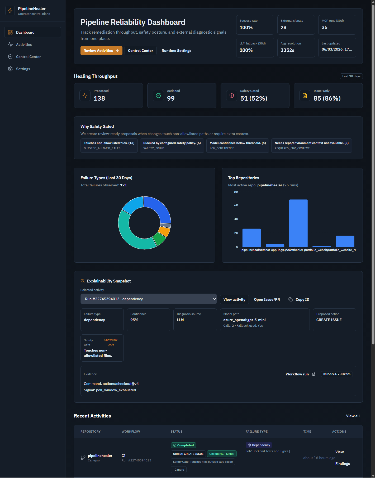
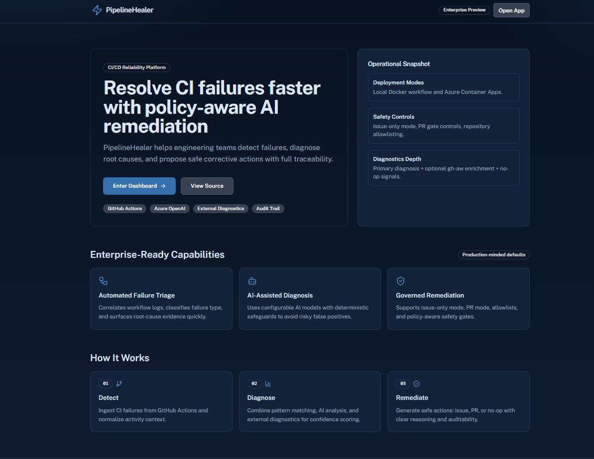
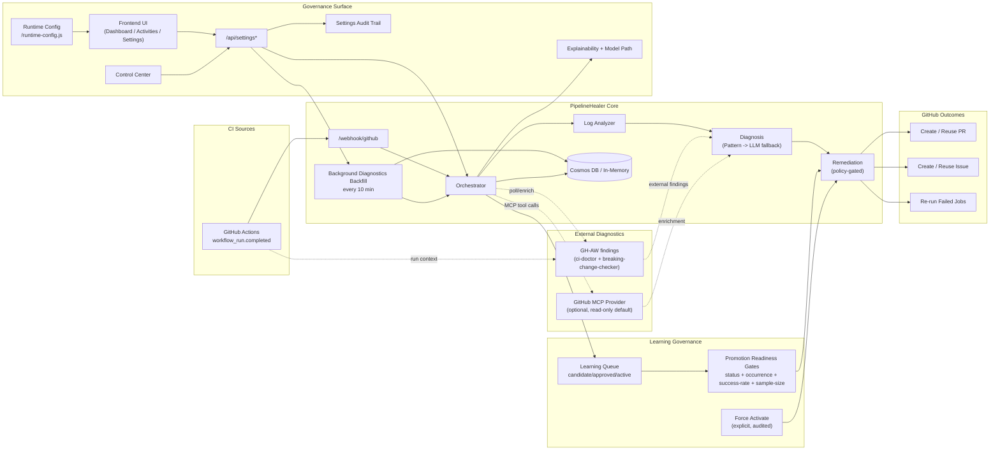

# PipelineHealer

<!-- LAST_VERIFIED: 59a9fc3 -->

> Policy-aware CI/CD remediation platform for GitHub Actions failures.

[](https://ca-canepro-ph-frontend.kinddune-53ac219d.eastus2.azurecontainerapps.io)
[](https://azure.microsoft.com)
[](https://github.com/Canepro/pipelinehealer/releases/tag/v0.3.1)
[](LICENSE)

PipelineHealer ingests failed workflow runs, diagnoses root causes, and applies controlled remediation:
- deterministic fixes open or reuse pull requests
- ambiguous or risky cases open structured issues instead of unsafe edits
- all actions are auditable, explainable, and tied to concrete run evidence




## Hackathon Snapshot

- Public repository: `https://github.com/Canepro/pipelinehealer`
- Live deployment: Azure Container Apps (backend + frontend)
- Current release baseline: [`v0.3.1`](https://github.com/Canepro/pipelinehealer/releases/tag/v0.3.1)
- Next scoped target: `v0.3.2` ([#44](https://github.com/Canepro/pipelinehealer/issues/44))
- Demo runbook: [docs/DEMO_SCRIPT.md](docs/DEMO_SCRIPT.md)

## Beginner Path (First 10 Minutes)

If this is your first run, start local with default key auth and no Entra setup.

1. Create env file:

```bash
cp backend/.env.example backend/.env
```

2. In `backend/.env`, set only:
- one LLM path (`AZURE_OPENAI_*` or `OPENAI_COMPATIBLE_*`)
- `GITHUB_PERSONAL_ACCESS_TOKEN`

3. Start backend (Terminal A):

```bash
cd backend
python3 -m venv .venv
source .venv/bin/activate
pip install -e ".[dev]"
uvicorn src.main:app --reload --port 8000
```

4. Start frontend (Terminal B):

```bash
cd frontend
bun install
bun run dev
```

5. Verify:
- `curl -sS http://127.0.0.1:8000/health` returns `{\"status\":\"healthy\"}`
- open `http://127.0.0.1:5173`

Defaults are already beginner-safe in `.env.example`:
- `HEAL_MODE=safe`
- `AUTH_MODE=api_key`
- `VITE_AUTH_MODE=none`

For managed deployment and full demo ops, use [docs/LOCAL_DEMO_RUNBOOK.md](docs/LOCAL_DEMO_RUNBOOK.md).

## Why PipelineHealer

CI failures create repetitive triage work and slow delivery. PipelineHealer reduces mean-time-to-understanding and mean-time-to-remediation with a safety-first flow:
- Analyze -> Diagnose -> Remediate agent pipeline
- policy gates (`HEAL_MODE`, per-action toggles, repo allowlists)
- explainability fields (`diagnosis_source`, reason codes, source attribution)
- universal failure context (`failing_job`, `failing_step`, `failing_command`, `signal`)
- idempotent artifacts (find-or-create PR/issue reuse)

## What Shipped In v0.3.1

- frontend runtime-first config for containerized deployments (`VITE_*` via `/runtime-config.js`)
- no-rebuild config updates through runtime env sync paths (ACA/Helm/compose)
- release workflow/frontend image decoupled from auth build-arg coupling

## Previously Shipped In v0.3.0

- Activity Detail `Copy Context` for one-click AI-ready handoff payloads (bounded + redacted)
- visible disabled `Assign to Agent` affordance (`Coming Soon`) for discoverability
- release hardening with anonymous GHCR pullability gating for:
  - backend/frontend tags (`vX.Y.Z` and `X.Y.Z`)
  - backend/frontend digests
  - Helm chart OCI tag (`X.Y.Z`)

Release notes: [CHANGELOG.md](CHANGELOG.md), [v0.3.1 release](https://github.com/Canepro/pipelinehealer/releases/tag/v0.3.1), and [v0.3.0 release](https://github.com/Canepro/pipelinehealer/releases/tag/v0.3.0)

## Kubernetes Portability Status

As of March 3, 2026 (`v0.3.1`), random-user image pullability regressions are gated in release automation.

- previous portability gap issue [#37](https://github.com/Canepro/pipelinehealer/issues/37) is closed
- Helm success output alone is still not sufficient proof; verify rollout and image pulls on clean clusters
- recommended operator path: use published release images and run release verification gates

Operational runbook: [docs/KUBERNETES_HELM_RUNBOOK.md](docs/KUBERNETES_HELM_RUNBOOK.md)

## Architecture



## Quick Start (Local)

1. Copy env template:

```bash
cp backend/.env.example backend/.env
```

2. Set minimum required values in `backend/.env`:
- choose one LLM path
  - Azure OpenAI: `AZURE_OPENAI_ENDPOINT`, `AZURE_OPENAI_DEPLOYMENT_NAME`, `AZURE_OPENAI_API_KEY`
  - OpenAI-compatible: `LLM_PROVIDER=openai_compatible`, `OPENAI_COMPATIBLE_BASE_URL`, `OPENAI_COMPATIBLE_MODEL`, `OPENAI_COMPATIBLE_API_KEY`
- set GitHub token: `GITHUB_PERSONAL_ACCESS_TOKEN`

3. Run backend and frontend in separate terminals:

```bash
cd backend
uv pip install --system -e ".[dev]"
uvicorn src.main:app --reload
```

```bash
cd frontend
bun install
bun run dev
```

For Docker/Azure/Kubernetes paths: [docs/LOCAL_DEMO_RUNBOOK.md](docs/LOCAL_DEMO_RUNBOOK.md)

## One-Command Ops

From repo root:

```bash
bash scripts/ph.sh help
bash scripts/ph.sh status
bash scripts/ph.sh settings:check
bash scripts/ph.sh deploy:release --release-version vX.Y.Z
bash scripts/ph.sh demo:e2e
bash scripts/ph.sh logs
```

Full CLI reference: [docs/CLI.md](docs/CLI.md)

Runtime config note:
- containerized frontend config (`VITE_*`, including Entra settings) is runtime-driven
- use `bash scripts/ph.sh deploy:env` to apply backend/frontend env changes without rebuilding images
- full `deploy` is only needed when code/image contents changed

## 2-Minute Demo Path

- Recording script: [docs/DEMO_SCRIPT.md](docs/DEMO_SCRIPT.md)
- On-camera E2E command:

```bash
bash scripts/ph.sh demo:e2e --triggers dependency,lint,test,build_config,timeout --wait-seconds 180 --ci-signal-wait-seconds 180
```

- Proof command:

```bash
bash scripts/ph.sh demo:proof --repo <owner>/<repo> --limit 5
```

## Security And Governance Defaults

- `HEAL_MODE=safe`
- independent execution/action toggles:
  - `AUTO_APPLY_REMEDIATION` (global execution gate)
  - `AUTO_CREATE_PR`, `AUTO_CREATE_ISSUE`, `AUTO_RETRY_WORKFLOW` (per-action outputs)
- protected settings APIs (`X-API-Key`; admin routes require `X-Admin-Key` in non-development)
- auditable settings changes and remediation traces
- MCP defaults: `MCP_ENABLED=false`, `MCP_READ_ONLY=true`

Security policy: [SECURITY.md](SECURITY.md)

## Versioning And Release

Version sources are synchronized across:
- `VERSION`
- `backend/pyproject.toml`
- `frontend/package.json`
- `charts/pipelinehealer/Chart.yaml` (`version`, `appVersion`)

Release helpers:

```bash
bash scripts/release_preflight.sh
bash scripts/release_checklist.sh minor
bash scripts/release.sh minor
bash scripts/release_verify.sh vX.Y.Z
```

Release runbook: [docs/RELEASE_RUNBOOK.md](docs/RELEASE_RUNBOOK.md)

## Documentation Map

- [Docs Index](docs/README.md)
- [Feature Guides](docs/features/README.md)
- [API Reference](docs/API.md)
- [CLI Reference](docs/CLI.md)
- [Local + Azure Runbook](docs/LOCAL_DEMO_RUNBOOK.md)
- [Kubernetes Helm Runbook](docs/KUBERNETES_HELM_RUNBOOK.md)
- [Logs & Investigation](docs/LOGS_AND_INVESTIGATION.md)
- [Future Plan](docs/FUTURE_PLAN.md)
- [Changelog](CHANGELOG.md)

## Contributing

Contributions are welcome. For workflow, quality gates, and docs policy:
- [CONTRIBUTING.md](CONTRIBUTING.md)
- [AGENTS.md](AGENTS.md)

When proposing changes, include target version alignment (`docs/FUTURE_PLAN.md`) and release-note intent (`Added`, `Changed`, or `Fixed`).
