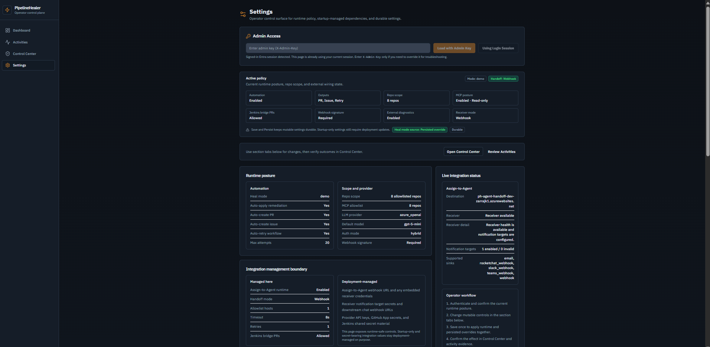
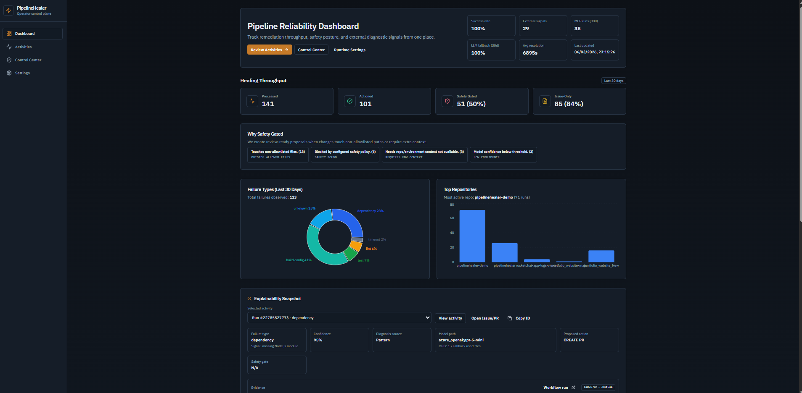
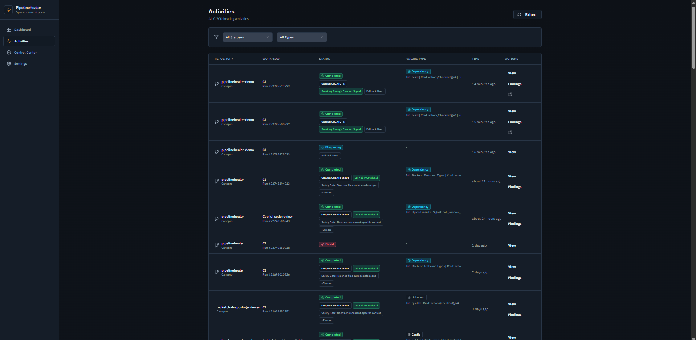

# PipelineHealer Demo Recording Guide (Single-File Runbook)

<!-- LAST_VERIFIED: d4b972c -->

Use this as the only doc during recording day. It includes:

- exact commands to run (copy-paste ready with safe defaults)
- checks to confirm each step
- fast fallback commands
- final 2-minute SHOW/TELL script

Related docs:

- `docs/LOCAL_DEMO_RUNBOOK.md` for deeper setup/troubleshooting
- `docs/HACKATHON_LOG.md` for submission checklist and milestone status
- `docs/API.md` for full API endpoint reference and best practices
- `docs/CLI.md` for the full CLI command reference

This runbook remains intentionally demo-specific and GitHub Actions-focused because the current recording flow uses the demo repo webhook path. That does not narrow the product scope; PipelineHealer itself is framed more broadly as a pipeline remediation control plane.

## Hackathon Requirement Alignment (March 9, 2026)

This runbook aligns to the submission checklist in `docs/HACKATHON_LOG.md`:

- Public repository: `https://github.com/Canepro/pipelinehealer`
- Live Azure deployment: `bash scripts/ph.sh urls`
- Project description: `README.md`
- Architecture diagram: `README.md` -> `Architecture` section
- Microsoft Learn profiles:
  - Vincent Mogah: `https://learn.microsoft.com/en-us/users/canepro0084/`
  - Logeshwaran R: `https://learn.microsoft.com/en-in/users/logeshwaranr-5820/`
  - Goziechukwu Chima-Duru: `https://learn.microsoft.com/en-us/users/GozieChimaDuru-2688`

Remaining submission item this doc drives: demo video length must be 2:00 max.

Default values used in this runbook:

```bash
export RELEASE_TAG="${RELEASE_TAG:-v0.6.1}"
export DEMO_REPO="${DEMO_REPO:-Canepro/pipelinehealer-demo}"
```

Keep `RELEASE_TAG` pinned to the latest published tag for recording. Do not point the demo flow at an untagged local branch or unreleased commit.
If `DEMO_REPO` is not exported in your shell, either run the export block above first or omit `--repo` and let `bash scripts/ph.sh demo:proof` fall back to the default demo repo.

## Recording Plan (2 Minutes Max)

Recommended recording mode:

1. Run the full E2E flow off camera first so the system has already produced activities, PRs, issues, and external findings.
2. On camera, show the live Azure-hosted UI plus one short terminal proof command.
3. Do not wait for the full `demo:e2e` command to finish on camera; its default wait budget is for rehearsal and proof, not for a 2-minute final cut.

Core on-camera path:

1. Dashboard story: show `Processed`, `Actioned`, `Safety Gated`, `Issue-Only`, plus header KPIs `MCP Runs (30d)` and `LLM Fallback (30d)`.
2. Release trust signal: briefly show the shell footer `Release` status so the deployed UI/API version alignment is visible.
3. Explainability drilldown: open one focused activity and show the incident record (`what happened`, `what PipelineHealer concluded`, `what it did`, `what still needs review`), then `Failure Context` / `Evidence Layers`.
4. External findings: expand `External Findings Details` to show ci-doctor's structured root cause, recommended actions, and doctor metadata.
5. Safety boundary: point to `Why Safety Gated` on the dashboard and explain issue-first fallback for risky cases.
6. Optional governance proof only if time remains: open `/settings`, show the section tabs (`Runtime Controls`, `AI & Integrations`, `Security & Advanced`), the Active Policy banner, and `Save & Persist`.

## 1) Pre-Record Setup (5-10 minutes before)

Run from repo root in WSL:

```bash
cd /mnt/d/repos/pipelinehealer
git status --short
git fetch origin main
git switch main
git pull --ff-only origin main
gh auth status
az account show --output table
bash scripts/ph.sh deploy:release --release-version "$RELEASE_TAG"
bash scripts/ph.sh warm
bash scripts/ph.sh status
bash scripts/ph.sh settings:check
```

Pass checks:

- `status` shows both apps with `MinReplicas` = `1`
- `settings:check` returns JSON (not `401`)
- response includes expected runtime values (for example `github_auth_mode`, `max_remediation_attempts`, `azure_openai_api_version`)
- `git status --short` is empty (or only known intentional files)

If `settings:check` fails with `401`:

```bash
bash scripts/ph.sh deploy:env
bash scripts/ph.sh settings:check
```

If `deploy:release` fails due Azure auth/session context:

```bash
az account show
az login
bash scripts/ph.sh deploy:release --release-version "$RELEASE_TAG"
```

## 2) Optional Clean Slate for Demo Repo

```bash
bash scripts/ph.sh demo:reset
```

Pass check:

- command ends with `Demo fixtures reset complete.` or `No fixture changes needed.`

## 3) Camera-Ready Staging (Run Before Recording)

```bash
bash scripts/ph.sh demo:e2e --repo "$DEMO_REPO" --triggers dependency,lint,test,build_config,timeout --wait-seconds 180 --ci-signal-wait-seconds 180
```

This is the recommended pre-record command. It produces the artifacts you will show on camera without forcing you to wait live during the final cut.

If you need full fixture coverage before recording, include `prettier,docker`:

```bash
bash scripts/ph.sh demo:e2e --repo "$DEMO_REPO" --triggers dependency,lint,test,build_config,timeout,prettier,docker --wait-seconds 180 --ci-signal-wait-seconds 180
```

What this command does:

- syncs webhooks (disables stale `smee.io`, enables Azure webhook)
- ensures demo fixtures are in the expected state
- triggers all five demo failure scenarios (`dependency`, `lint`, `test`, `build_config`, `timeout`)
- polls activity states to terminal (`completed` / `failed`) and prints runs, PRs, issues, and backend activity output
- triggers an on-demand backfill sweep before final summary so late external diagnostics can be attached without waiting for the 10-minute background sweep
- waits for a CI doctor workflow signal (`CI Failure Doctor` / `ci-doctor`) and prints whether that signal was observed
- prints MCP verification counters so you can separate passive diagnostics, hybrid diagnostics, and direct MCP tool usage

Pass checks in output:

- workflow dispatch events created
- at least one dependency/lint remediation shows PR creation
- test/build_config/timeout produce issues (or structured failure records)
- `CI doctor signal detected` appears (best effort; if delayed, run `bash scripts/ph.sh backfill` and verify in Activity Detail)
- MCP interpretation:
  - `mcp_tool_calls_total > 0` = direct MCP invocation observed
  - `mcp_tool_calls_total = 0` + passive diagnostics/source attribution = passive mode worked as designed
  - In hybrid mode, expect mixed source attribution in one activity (`gh_aw_passive` + `github_mcp_direct` and/or `github_mcp_blocked`)

Rehearsal-only strict gate:

```bash
bash scripts/ph.sh demo:e2e --repo "$DEMO_REPO" --triggers dependency,lint,test,build_config,timeout --wait-seconds 180 --ci-signal-wait-seconds 300 --strict
```

## 4) Short On-Camera Terminal Proof

Use one fast command on camera after the off-camera staging run:

```bash
bash scripts/ph.sh demo:proof --repo "$DEMO_REPO" --limit 5
```

Safe fallback if `DEMO_REPO` is unset:

```bash
bash scripts/ph.sh demo:proof --limit 5
```

What to say while it runs:

- it proves the GitHub-side outputs already exist
- PRs represent deterministic, high-confidence fixes
- issues represent guarded or non-deterministic cases
- the UI shows the same activities with diagnosis, evidence, and policy context

If you insist on a live trigger on camera, keep it to one failure type and do not wait for full completion:

```bash
gh workflow run CI --repo "$DEMO_REPO" --field failure_type=dependency
```

Then verify:

```bash
bash scripts/ph.sh demo:proof --repo "$DEMO_REPO" --limit 5
```

## 5) Verification Commands (If You Need Extra Proof)

```bash
bash scripts/ph.sh demo:proof --repo "$DEMO_REPO" --limit 10
bash scripts/ph.sh urls
bash scripts/ph.sh settings:check
bash scripts/ph.sh audit:proof --limit 5
bash scripts/ph.sh settings:audit --limit 5
bash scripts/ph.sh logs
bash scripts/ph.sh logs:grep --pattern "debug-mode"
```

Expected result pattern:

- PRs: dependency + lint
- Issues: test + build_config + timeout
- Admin audit proof should show latest entries containing `request_id`, actor fingerprint, and old/new change values.
- Settings page should show runtime scope clearly (`Allowlist (N)` or `Unrestricted`) in the Effective Runtime Policy banner and keep controls organized by section tabs.

Reference visual:



### External diagnostics enrichment

ci-doctor findings use a fast-path wait budget (default 60s) during pipeline execution. If findings are not published within that window, the backfill sweep runs automatically every 10 minutes and enriches activities when results arrive.

For immediate results, trigger manually:

```bash
bash scripts/ph.sh backfill
```

Or use the "Backfill Diagnostics" button on the Activity Detail page in the UI.

Enriched activities show an "External Findings Details" collapsible panel in Activity Detail with structured root cause, recommended actions, and doctor metadata.

## 6) 2-Minute Recording Script (Final)

Timing sanity check (March 9, 2026):
- core `TELL` script below is intentionally short so clicks, page loads, and one terminal proof command still fit inside 2:00
- do not add the optional differentiator on top of the core script; swap it in only if you cut something else

### 0:00-0:15

SHOW: GitHub Actions failure, then the live PipelineHealer dashboard.

TELL: CI failures slow delivery and force teams into repetitive triage. PipelineHealer is an Azure-hosted control plane that turns failed GitHub Actions runs into structured diagnosis and safe remediation.

### 0:15-0:30

SHOW: Dashboard KPIs `Processed`, `Actioned`, `Safety Gated`, `Issue-Only`, plus the shell footer release status.

TELL: The dashboard shows what happened at a glance, and the shell footer shows the deployed release so operators can confirm the UI and API are aligned in production.

### 0:30-0:50

SHOW: Activities list, then open one completed activity.



TELL: When a `workflow_run` fails, PipelineHealer analyzes the logs, diagnoses the root cause, and then chooses a policy-safe remediation path. Deterministic cases can become PRs. Risky or ambiguous cases fall back to structured issues.

### 0:50-1:30

SHOW: Activity detail incident record, `Failure Context`, `Evidence Layers`, then expand `External Findings Details`.



TELL: Each activity keeps the incident story, diagnosis, remediation result, verification state, evidence layers, and external findings in one place. That makes the system explainable and auditable instead of acting like a black box.

### 1:30-1:50

SHOW: Terminal running:

```bash
bash scripts/ph.sh demo:proof --repo "$DEMO_REPO" --limit 5
```

SHOW: Output listing recent runs, PRs, and issues.

TELL: This quick proof shows the GitHub-side artifacts: PRs for deterministic fixes and issues for guarded cases. The UI and the terminal evidence stay aligned.

### 1:50-2:00

SHOW: Return to dashboard `Why Safety Gated` card or the activity remediation outcome.

TELL: PipelineHealer shifts teams from reactive troubleshooting to policy-bound, auditable remediation, improving delivery reliability without hiding uncertainty.

### Optional 30-Second Differentiator Insert

Use this if you want to emphasize why PipelineHealer stands out in a crowded AI hackathon field:

TELL: PipelineHealer is not just an AI that opens PRs. It is an AI-governed remediation system with explicit trust boundaries. High-confidence, deterministic cases become reviewable PRs. Low-confidence cases become structured issues with a proposed fix, reason code, and validation steps, so uncertainty is visible instead of hidden. That gives teams speed without losing control: every action is policy-bound, auditable, and observable in the dashboard.

## 7) Post-Record Cleanup

Merge or close demo artifacts if needed:

```bash
gh pr list -R "$DEMO_REPO"
gh issue list -R "$DEMO_REPO" --state open
```

Return to low-cost mode:

```bash
bash scripts/ph.sh lowcost
bash scripts/ph.sh status
```

Pass check:

- `MinReplicas` returns to `0` for backend and frontend

## 8) Quick Troubleshooting

`401` from `/api/settings`:

```bash
bash scripts/ph.sh deploy:env
bash scripts/ph.sh settings:check
```

`AADSTS50011` redirect URI mismatch during Entra sign-in:

- Add the exact redirect URI used by the app (for example `https://<frontend-fqdn>/app`) in the SPA app registration.
- Wait 1-2 minutes for propagation and retry in incognito.

`401 Invalid bearer token` after successful Entra login:

- Confirm backend `AUTH_MODE` and `ENTRA_*` values are synced (`bash scripts/ph.sh deploy:env`).
- If frontend `VITE_ENTRA_*` changed, sync runtime env (`bash scripts/ph.sh deploy:env`) and hard refresh browser cache.

`Client error '403 Forbidden' for GitHub issue/PR creation`:

- Most common cause: token lacks repository write permissions for the target repo.
- For fine-grained PATs, ensure repository access is granted and Issues/PR write permissions are enabled.
- Check repo settings (Issues enabled, repo not archived/read-only).
- Verify token scope/access with:

```bash
gh auth status
gh issue create -R "$DEMO_REPO" -t "PipelineHealer auth test" -b "test"
```

- Ensure `GITHUB_PERSONAL_ACCESS_TOKEN` in `backend/.env` is correct, then sync:

```bash
bash scripts/ph.sh deploy:env
```

Terminal closes unexpectedly:

- run scripts with `bash scripts/...`
- do not use `source` or `. scripts/...`

Podman unavailable (only relevant for local/full-build deploy path):

```bash
podmanup
```

Then re-run deploy:

```bash
bash scripts/ph.sh deploy
```
